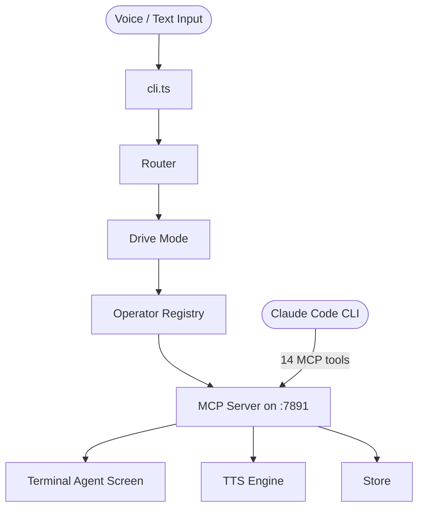

# claude-drive

**Voice-first multi-operator pair programming for Claude Code CLI**

[](https://www.npmjs.com/package/claude-drive)
[](https://github.com/drive-mode/claude-drive/actions)

---

## What it does

Claude Drive brings multi-operator pair programming to the Claude Code CLI. Instead of a single AI session, you coordinate a named pool of operators — implementers, reviewers, testers, researchers, and planners — each with scoped permissions and a dedicated role.

Operators communicate through a local MCP server on `:7891`, which acts as the coordination hub: routing commands, managing state, synthesizing speech, and streaming live activity to a terminal agent screen. The whole system runs locally with no cloud backend — your code and context never leave your machine.

Drive mode keeps everyone in sync. Switching sub-modes (`plan`, `agent`, `ask`, `debug`) shifts the active operator and changes the tooling context without interrupting your flow.

---

## Quick Start

### Install

```bash
npm install -g claude-drive
```

### Start the server

```bash
claude-drive start
```

This launches the MCP server on `localhost:7891` and prints the snippet to add to Claude Code.

### Add to Claude Code

Add the MCP server to `~/.claude/settings.json` so Claude Code picks it up automatically:

```json
{
  "mcpServers": {
    "claude-drive": {
      "url": "http://localhost:7891/mcp"
    }
  }
}
```

### Run a session

```bash
# Spawn a named implementer operator
claude-drive operator spawn Alpha --role implementer

# Spawn a reviewer alongside it
claude-drive operator spawn Beta --role reviewer --preset readonly

# List active operators
claude-drive operator list

# Run a one-shot task
claude-drive run "refactor auth module" --name Alpha --role implementer
```

From inside a Claude Code session, operators call MCP tools like `agent_screen_activity`, `agent_screen_decision`, and `tts_speak` to coordinate in real time.

---

## Features

- **Multi-operator registry** — spawn, switch, and dismiss named operators (`implementer`, `reviewer`, `tester`, `researcher`, `planner`) within a single session
- **MCP bridge** — 14 MCP tools exposed on `localhost:7891`; the only coordination channel between Claude Code and Drive state — no sidecar processes or cloud calls
- **TTS speech synthesis** — edge-tts → piper → say fallback chain; operators can speak status updates and decisions aloud
- **Permission presets** — `readonly` (Read/Glob/Grep/WebSearch/WebFetch), `standard` (+ Edit/Write/Bash/Agent), `full` — scoped per operator role
- **Drive sub-modes** — `plan`, `agent`, `ask`, `debug`, `off` — shift context and active tooling without restarting
- **Terminal agent screen** — live ANSI output showing operator activity feed, files touched, and decisions made (Ink TUI planned)
- **Config layering** — CLI flags > env vars > `~/.claude-drive/config.json` > defaults
- **Local-first, privacy-strict** — no telemetry, no cloud state; everything runs on your machine

---

## Architecture



### Request pipeline

```
Voice/Text Input
  → fillerCleaner → sanitizer → glossaryExpander
  → router (intent classification)
  → operator (Claude Code with MCP tools)
  → mcpServer (state updates, TTS, Agent Screen)
  → terminal output + speech
```

---

## Commands

| Command | Description |
|---|---|
| `claude-drive start` | Start the MCP server on `:7891` |
| `claude-drive run <task>` | Run a one-shot task with an operator |
| `claude-drive operator spawn [name]` | Spawn a new operator (`--role`, `--preset`) |
| `claude-drive operator list` | List all active operators |
| `claude-drive operator switch <name>` | Make a named operator the foreground operator |
| `claude-drive operator dismiss <name>` | Dismiss an operator |
| `claude-drive mode set <mode>` | Set drive sub-mode (`plan`, `agent`, `ask`, `debug`, `off`) |
| `claude-drive mode status` | Show current drive state |
| `claude-drive config set <key> <value>` | Persist a config value to `~/.claude-drive/config.json` |
| `claude-drive config get <key>` | Read a config value |
| `claude-drive tts <text>` | Speak text via TTS |

---

## Documentation

- [Architecture](docs/architecture.md)
- [Operators](docs/operators.md)
- [MCP Tools Reference](docs/mcp-tools.md)
- [CLI Reference](docs/cli-reference.md)
- [Configuration](docs/configuration.md)
- [TTS Setup](docs/tts-setup.md)
- [Claude Code Integration](docs/claude-code-integration.md)
- [Agent Screen](docs/agent-screen.md)
- [Contributing](CONTRIBUTING.md)

---

## License

MIT
