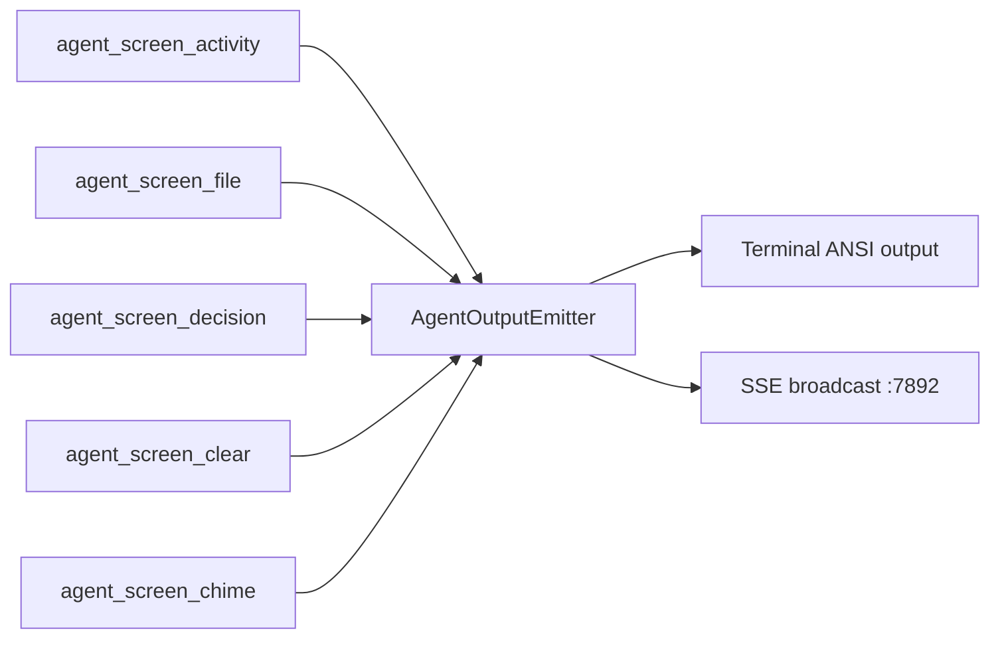
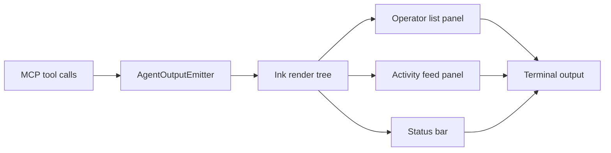

# Agent Screen

## Overview

The agent screen is the real-time activity feed for a Claude Drive session. It shows what every operator is doing at a glance — files touched, decisions made, and status messages — all multiplexed into a single terminal output stream.

In a multi-operator session, several AI agents can be active at the same time, each working in its own git worktree. Without a shared display, you would have no way of knowing which operator is doing what, or whether they are stepping on each other. The agent screen solves this by tagging every event with the operator's name and rendering each operator in a distinct ANSI color, making it easy to track parallel activity at a glance.

Output is written to the terminal that launched Claude Drive. An optional SSE broadcast on `:7892` lets external consumers (dashboards, scripts) subscribe to the same event stream as structured JSON.

---

## Current Output Format

```bash
10:42:01 [Alpha] Starting implementation of auth module
10:42:03 [Alpha] write src/auth/token.ts
10:42:05 [Beta]  Starting review of existing tests
10:42:07 [Alpha] Decision: Use RS256 for JWT signing — avoids symmetric key sharing
10:42:09 [Beta]  read tests/auth.test.ts
10:42:12 [Alpha] write src/auth/middleware.ts
```

Each line is prefixed with a wall-clock timestamp. The operator name appears in its assigned ANSI color. Decision lines are distinguished by the `Decision:` label. File lines show the action verb (`read`, `write`, `delete`, etc.) followed by the path.

---

## Event Types

| Event type | Key fields | Terminal rendering |
|---|---|---|
| `activity` | `agent`, `text`, `timestamp?` | `HH:MM:SS [OperatorName] text` |
| `file` | `agent`, `path`, `action?` | `HH:MM:SS [OperatorName] {action} path` |
| `decision` | `agent`, `text` | `HH:MM:SS [OperatorName] Decision: text` |
| `chime` | `name?` | Terminal bell `\x07` |
| `clear` | _(none)_ | Clear screen `\x1b[2J\x1b[H` |

All events except `clear` and `chime` carry an `agent` field that identifies the operator. The `timestamp` field on `activity` events is optional; if absent the renderer uses the current wall-clock time.

---

## MCP Tools Wiring

Operators call MCP tools on `localhost:7891`. Each `agent_screen_*` tool maps to a method or emit on `AgentOutputEmitter`, which then renders to the terminal and optionally broadcasts over SSE.



The mapping between MCP tool and emitter method:

| MCP tool | Emitter call |
|---|---|
| `agent_screen_activity` | `logActivity(agent, text)` |
| `agent_screen_file` | `logFile(agent, path, action?)` |
| `agent_screen_decision` | `logDecision(agent, text)` |
| `agent_screen_clear` | `agentOutput.emit("event", {type: "clear"})` |
| `agent_screen_chime` | `agentOutput.emit("event", {type: "chime", name})` |

See [mcp-tools](./mcp-tools.md) for the full MCP tool reference.

---

## Status Line

`printStatus(active, mode, operatorName?, backgroundCount)` writes a persistent status summary to **stderr** so it does not mix with the main event stream.

Format:

```
[Drive] ● agent | Alpha (+1)
```

| Part | Meaning |
|---|---|
| `[Drive]` | Always present; identifies the process |
| `●` / `○` | Filled dot = drive active; hollow dot = inactive |
| `agent` | Current drive sub-mode (`plan`, `agent`, `ask`, `debug`) |
| `Alpha` | Name of the foreground operator |
| `(+1)` | Number of additional operators running in the background |

When drive is inactive the line renders with a hollow dot and no operator name:

```
[Drive] ○ idle
```

---

## Operator Colors

Each operator is assigned one color from a fixed cycling palette when it first appears in the event stream:

| Slot | Color |
|---|---|
| 0 | Cyan |
| 1 | Magenta |
| 2 | Yellow |
| 3 | Green |
| 4 | Blue |
| 5 | Red |

Assignment wraps around after slot 5, so a seventh operator reuses cyan. Colors are applied to the `[OperatorName]` bracket and the text that follows it. Because the assignment is determined by insertion order, operators keep the same color for the lifetime of a session even if other operators are dismissed.

---

## SSE Stream

When an SSE broadcast function is registered via `agentOutput.setSseBroadcast(fn)`, every event is also pushed as a JSON payload to clients connected on port `:7892`.

Each payload is one JSON object per line, delivered as a standard `text/event-stream` response:

```
data: {"type":"activity","agent":"Alpha","text":"Starting implementation","timestamp":1710678121000}

data: {"type":"file","agent":"Alpha","path":"src/auth/token.ts","action":"write"}

data: {"type":"decision","agent":"Alpha","text":"Use RS256 for JWT signing"}
```

This endpoint is intended for external consumers such as custom dashboards, logging pipelines, or test harnesses that want to observe operator activity without parsing ANSI escape sequences. It carries the same events as the terminal output; no filtering or buffering is applied.

---

## Planned Ink TUI

The current ANSI renderer is a flat log stream. The planned upgrade replaces it with an [Ink](https://github.com/vadimdemedes/ink) TUI — a React-like framework for terminal UIs — to enable a structured panel layout and interactive features.

### Architecture



Events still flow through `AgentOutputEmitter` — the render target changes from raw ANSI strings to Ink component state updates.

### Terminal Hyperlinks for File Paths

File events will render their `path` field as a terminal hyperlink (OSC 8 escape sequence). In supporting terminals (iTerm2, Windows Terminal, GNOME Terminal) the path becomes clickable and opens the file in the configured editor. In terminals that do not support OSC 8 the path renders as plain text with no visible difference.

### Panel Layout

```
+------------------+-----------------------------------------------+
| Operators        | Activity Feed                                 |
|                  |                                               |
| ● Alpha  [cyan]  | 10:42:01 [Alpha] Starting auth module         |
| ● Beta   [mag]   | 10:42:03 [Alpha] write src/auth/token.ts      |
|                  | 10:42:05 [Beta]  Starting review of tests     |
|                  | 10:42:07 [Alpha] Decision: Use RS256           |
|                  | 10:42:09 [Beta]  read tests/auth.test.ts      |
+------------------+-----------------------------------------------+
| [Drive] ● agent | Alpha (+1)                                    |
+---------------------------------------------------------------+
```

The left panel lists all registered operators with their color and active/idle indicator. The right panel scrolls the activity feed. The bottom bar is the status line described above.

### Configuration

The render mode is controlled by the `agentScreen.mode` key in [configuration](./configuration.md):

| Value | Behavior |
|---|---|
| `"terminal"` | Current ANSI flat-log renderer (default) |
| `"web"` | Serves SSE on `:7892`; pairs with a browser-based dashboard |

When the Ink TUI ships it will become the default for `"terminal"` mode. The `"web"` mode SSE stream is unaffected by the renderer change.
