# Architecture Guide

This document describes the internal architecture of claude-drive — how the pieces fit together, the key data flows, and the design decisions behind them.

## Overview

claude-drive is a standalone Node.js daemon that acts as a bridge between Claude Code CLI and the multi-operator orchestration system originally built for Cursor IDE. It exposes tools via MCP (Model Context Protocol) that Claude Code calls to spawn operators, run tasks, manage sessions, and more.

Think of it as a "mission control" process: Claude Code talks to it over MCP, it coordinates multiple Claude subagents (operators), each isolated in their own git worktree, with safety gates, TTS narration, and session persistence.

## System Context

```
┌─────────────────┐     MCP (HTTP)      ┌──────────────────┐
│   Claude Code    │ ◄─────────────────► │   claude-drive   │
│   (user's CLI)   │     localhost:7891   │   (daemon)       │
└─────────────────┘                      └────────┬─────────┘
                                                  │
                                    ┌─────────────┼──────────────┐
                                    ▼             ▼              ▼
                              ┌──────────┐ ┌──────────┐ ┌──────────────┐
                              │ Operator │ │ Operator │ │  Operator    │
                              │ "Alpha"  │ │ "Beta"   │ │  "Gamma"     │
                              │ (Agent   │ │ (Agent   │ │  (Agent      │
                              │  SDK)    │ │  SDK)    │ │   SDK)       │
                              └────┬─────┘ └────┬─────┘ └──────┬──────┘
                                   │             │              │
                              ┌────▼─────┐ ┌────▼─────┐ ┌──────▼──────┐
                              │ worktree │ │ worktree │ │  worktree   │
                              │ /drive/  │ │ /drive/  │ │  /drive/    │
                              │ op/aaa   │ │ op/bbb   │ │  op/ccc     │
                              └──────────┘ └──────────┘ └─────────────┘
```

## Module Dependency Graph

```
cli.ts (entry point)
  ├── config.ts ──────────────── config loader
  ├── driveMode.ts ──────────── state machine
  ├── operatorRegistry.ts ───── operator lifecycle
  ├── operatorManager.ts ────── Agent SDK wrapper
  │     ├── agentOutput.ts       (logging)
  │     ├── tts.ts               (narration)
  │     └── config.ts            (port lookup)
  ├── mcpServer.ts ──────────── HTTP + MCP protocol
  │     ├── operatorRegistry.ts
  │     ├── operatorManager.ts
  │     ├── agentOutput.ts
  │     ├── tts.ts
  │     ├── approvalQueue.ts
  │     ├── sessionManager.ts
  │     ├── worktreeManager.ts
  │     └── gitService.ts
  ├── agentOutput.ts ────────── terminal output
  ├── router.ts ─────────────── intent classification
  ├── tts.ts ────────────────── TTS dispatch
  │     ├── edgeTts.ts           (cloud neural TTS)
  │     └── piper.ts             (local neural TTS)
  ├── tui.tsx ───────────────── Ink/React TUI
  └── store.ts ──────────────── JSON KV persistence
```

## Core Subsystems

### 1. CLI Entry Point (`cli.ts`)

The CLI is built with `commander`. It defines subcommands (`start`, `run`, `operator`, `mode`, `tts`, `config`, `port`, `install`) and lazy-imports heavy modules (MCP server, TUI) only when needed to keep startup fast.

Key flow for `start`:
1. Create shared instances: `OperatorRegistry`, `DriveModeManager`
2. Subscribe to registry events for TTS announcements
3. Start MCP server (binds HTTP port, writes port file)
4. Optionally start Ink TUI
5. Wait for SIGINT/SIGTERM, then clean up

### 2. MCP Server (`mcpServer.ts`)

The MCP server is the main interface between Claude Code and claude-drive. It uses `@modelcontextprotocol/sdk` with `StreamableHTTPServerTransport` for per-session connections over HTTP.

Port binding strategy: tries the configured port, then up to `portRange` consecutive ports. On success, writes the actual port to `~/.claude-drive/port`. On exit, deletes the port file.

The server registers 26 tools organized into groups (operator management, agent screen, TTS, drive mode, task execution, approvals, worktrees, sessions). Each tool handler receives Zod-validated input and returns JSON results.

### 3. Operator Registry (`operatorRegistry.ts`)

The registry is the central state manager for operators. It tracks all operators in a Map keyed by ID, emits events on changes, and enforces constraints like max concurrent operators and permission inheritance.

Operator lifecycle: `spawn → active → background/paused → completed/merged`

Each operator has a `PermissionPreset` (`readonly`, `standard`, `full`) that controls which Claude Code tools it can use. Child operators (created via `delegate`) are constrained to at most the parent's permission level.

Roles (`implementer`, `reviewer`, `tester`, `researcher`, `planner`) map to default presets and system hints that shape operator behavior.

### 4. Operator Manager (`operatorManager.ts`)

Wraps the Claude Agent SDK's `query()` function. For each operator, it builds a system prompt incorporating the operator's role, memory, and Drive tool hints, then runs a conversation turn. It hooks into Edit/Write/Bash tool calls to log activity to the agent screen.

### 5. Drive Mode (`driveMode.ts`)

A simple state machine with two dimensions: `active` (boolean) and `subMode` (plan | agent | ask | debug | off). Changes are persisted to `store.ts` and broadcast via EventEmitter.

The `router.ts` module classifies user input into the appropriate mode by matching keywords and explicit commands.

### 6. Approval Gates (`approvalGates.ts` + `approvalQueue.ts`)

A safety layer that scans operator commands against configurable regex patterns before execution.

Three tiers: `block` (e.g., `rm -rf /`), `warn` (e.g., `git push --force`), `log` (e.g., `npm publish`). Blocked commands require explicit user approval via the approval queue, which uses a promise-based request/response pattern with 30-second auto-deny timeout.

Per-operator throttling kicks in after 3 blocks or 5 warnings in a session.

### 7. Git Worktree Manager (`worktreeManager.ts` + `gitService.ts`)

Each operator can be isolated in its own git worktree. The `WorktreeManager` creates a branch (`drive/op/<id>`) and worktree directory, then tracks the allocation. When the operator finishes, the worktree can be merged back to the base branch and cleaned up.

Operations are serialized via a promise-chain mutex to avoid concurrent git conflicts.

`GitService` is a typed wrapper around `child_process.execFile` for all git commands, with dependency-injectable exec for testing.

### 8. TTS (`tts.ts`, `edgeTts.ts`, `piper.ts`)

Three backends in fallback order:

1. **edgeTts** — Cloud-based Microsoft Edge neural TTS via `edge-tts-universal`. Synthesizes to MP3, plays with platform-specific player (afplay/aplay/PowerShell).
2. **piper** — Local neural TTS. Requires downloading the piper binary and a voice model. Spawns a process, pipes text to stdin.
3. **say** — System TTS (macOS `say`, or platform equivalent via the `say` npm package).

Sentences are truncated to `maxSpokenSentences` (default 3) to keep narration snappy.

### 9. Session Management (`sessionManager.ts` + `sessionStore.ts`)

Sessions capture a snapshot of the full Drive state: active operators, drive mode, and activity log. Snapshots are serialized to `~/.claude-drive/sessions/<id>.json`.

Restore re-spawns operators from the snapshot, skipping any that fail.

### 10. Agent Output (`agentOutput.ts` + `tui.tsx`)

`AgentOutputEmitter` is a singleton EventEmitter that dispatches structured events (activity, file, decision, chime, clear). In plain terminal mode, it renders colored output to stderr. In TUI mode, the Ink/React components subscribe to events and render a two-pane layout.

## Data Flow: Running a Task

```
1. Claude Code calls `drive_run_task` via MCP
2. mcpServer validates input, checks approval gates
3. operatorRegistry.spawn() creates operator context
4. worktreeManager.allocate() creates git branch + worktree
5. operatorManager.runOperator() calls Agent SDK query()
6. Agent SDK executes tools → hooks log to agentOutput
7. agentOutput emits events → terminal/TUI renders
8. tts.speak() narrates key decisions
9. On completion, operator is marked completed
10. worktreeManager.merge() integrates changes
```

## State & Persistence

| Store | Location | Purpose |
|-------|----------|---------|
| Config | `~/.claude-drive/config.json` | User preferences |
| State | `~/.claude-drive/state.json` | Drive mode, runtime KV |
| Sessions | `~/.claude-drive/sessions/*.json` | Operator snapshots |
| Port | `~/.claude-drive/port` | Live server port (ephemeral) |

## Key Design Decisions

**ESM-only**: The project uses native ES modules (`"type": "module"` in package.json) with NodeNext module resolution. All relative imports require `.js` extensions.

**Lazy imports**: Heavy modules (MCP server, TUI, Agent SDK) are imported dynamically in cli.ts to keep `claude-drive --help` fast.

**Event-driven architecture**: The registry, drive mode, approval queue, and agent output all use Node.js EventEmitter for loose coupling between subsystems.

**Permission inheritance**: Child operators can never exceed their parent's permission level. This prevents privilege escalation when operators delegate subtasks.

**Promise-chain mutex**: Git worktree operations are serialized through a promise chain to avoid concurrent conflicts, without the complexity of a full mutex library.

**Fallback chains**: TTS tries multiple backends in order (edgeTts → piper → say). Config loading falls through runtime → env → file → defaults. Port binding tries a range of ports.

## Relationship to cursor-drive

claude-drive is a port of the cursor-drive VS Code extension. ~60% of the source is adapted, with VS Code APIs (ExtensionContext, OutputChannel, TreeView) replaced by Node.js equivalents (fs, EventEmitter, Ink TUI).

Files kept in sync manually: `operatorRegistry.ts`, `router.ts`, `syncTypes.ts`, `tts.ts`, `edgeTts.ts`, `piper.ts`.
# claude-drive Architecture

## 1. High-Level System Overview

Claude Code connects via MCP. The daemon orchestrates operators through the SDK, with memory, safety, and persistence layers underneath.

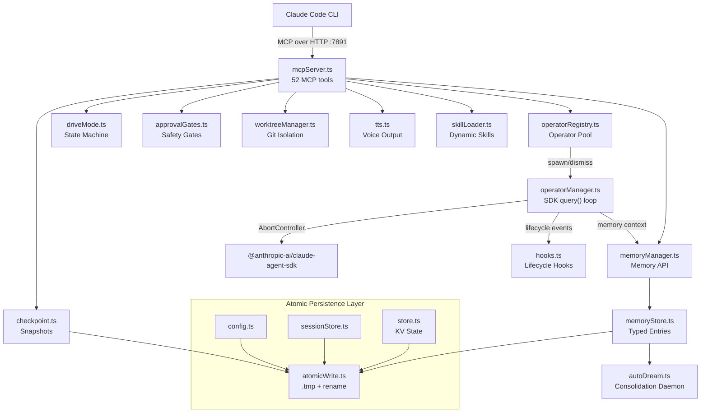

---

## 2. Startup Sequence

Fail-fast SDK validation, then hooks/skills/auto-dream initialization, then MCP server bind.

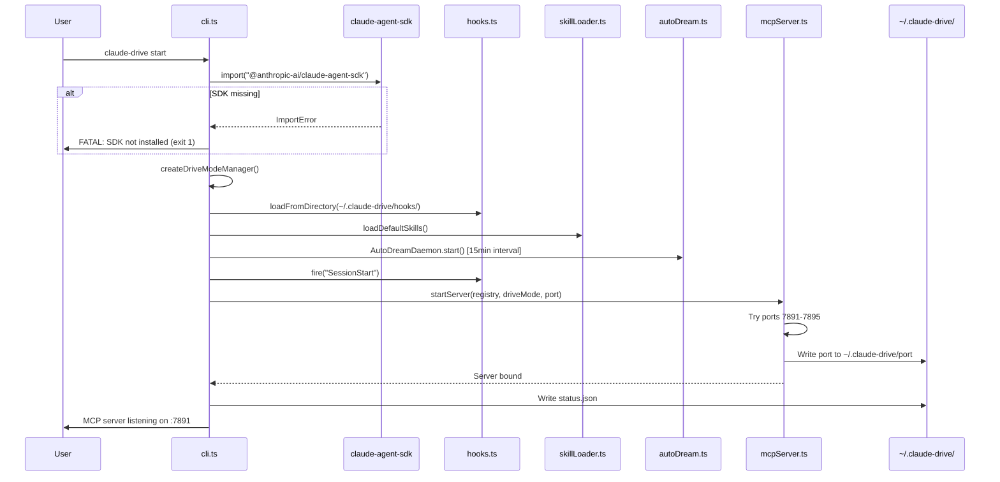

---

## 3. Operator Lifecycle State Machine

Only ONE operator can be Active (foreground) at a time. Dismiss fires AbortController and cascades to children.

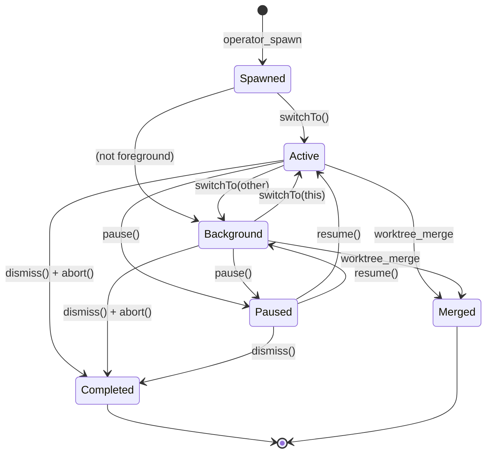

---

## 4. Task Dispatch Flow

MaxConcurrent check, AbortController setup, memory context injection, SDK query loop with cost extraction.

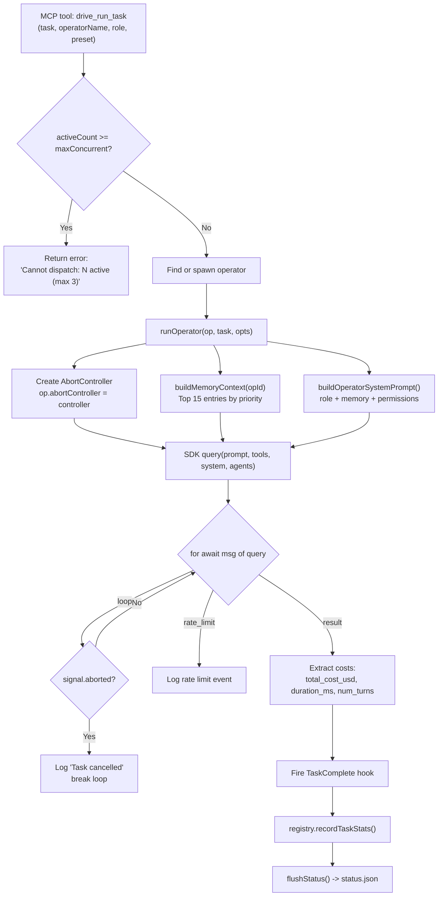

---

## 5. Memory System & Auto-Dream

Typed entries with confidence decay. Auto-dream consolidates every 15 minutes.

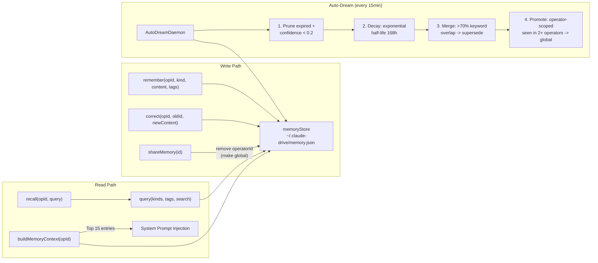

**Memory priority** (for system prompt context): corrections > decisions > facts > preferences > context

---

## 6. Safety & Approval Gates

Pattern-based filtering with per-operator throttling. 3+ blocks or 5+ warnings = operator throttled.

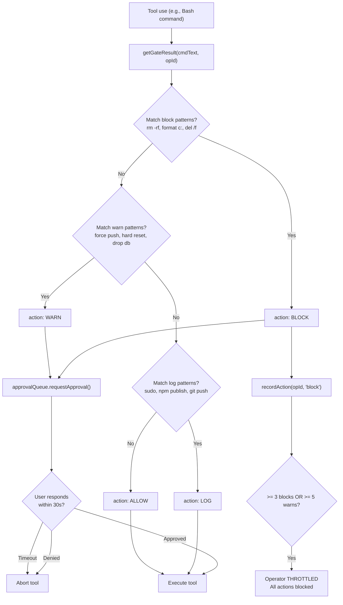

---

## 7. Persistence Architecture

Everything goes through `atomicWriteJSON()` — write to `.tmp`, then `rename`. Atomic on POSIX and NTFS.

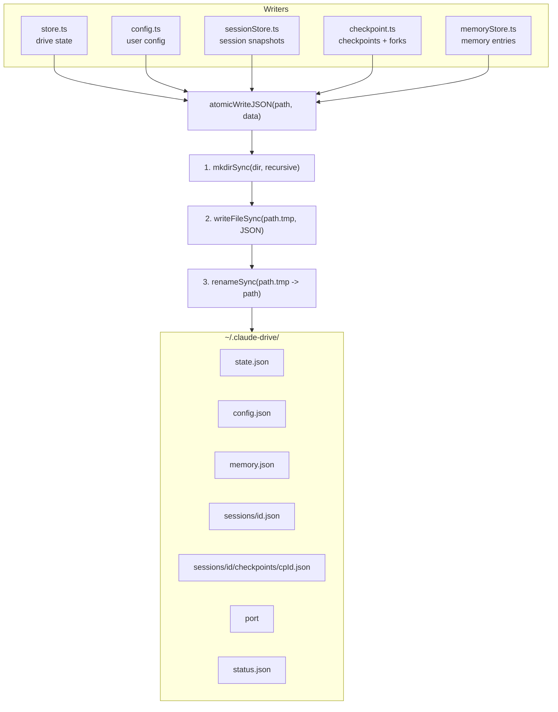

---

## 8. Drive Mode State Machine

Controls behavior mode. Persists to `store.ts`. Fires `ModeChange` hook on transition.

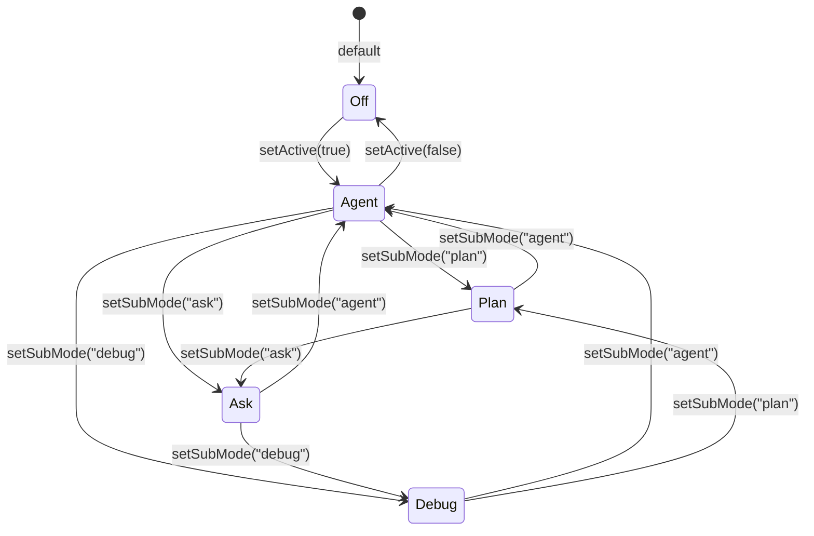

---

## 9. Hook System

9 lifecycle events, filtered by matcher regex, sorted by priority. Exit code 2 = abort operation.

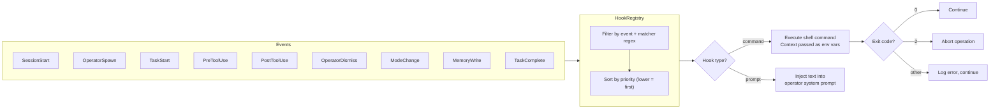

---

## 10. Worktree Isolation

Each operator gets its own git branch and working directory. Promise-chain mutex serializes git ops.

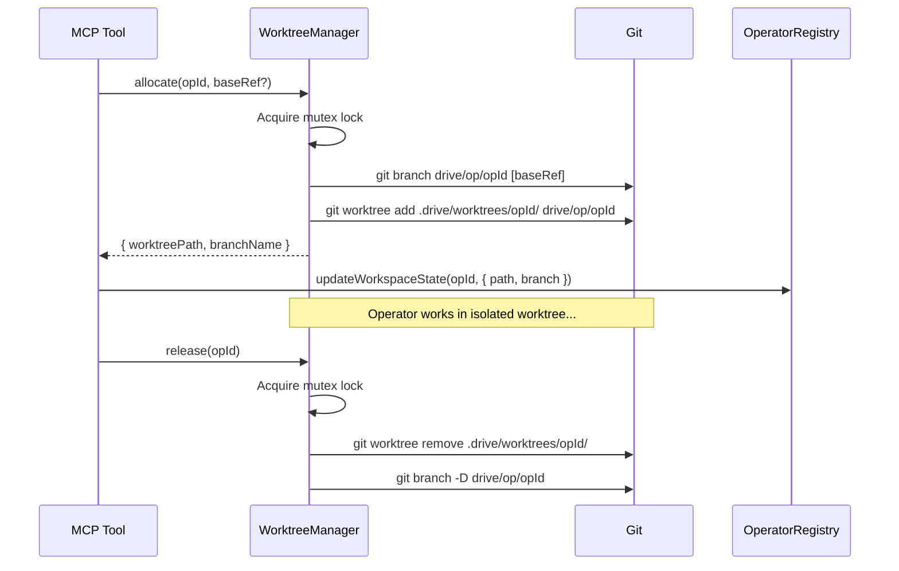

---

## 11. Full Module Dependency Map

Complete import graph across all 28 TypeScript modules. Purple = shared atomic write layer. Blue = entry point. Green = MCP surface.

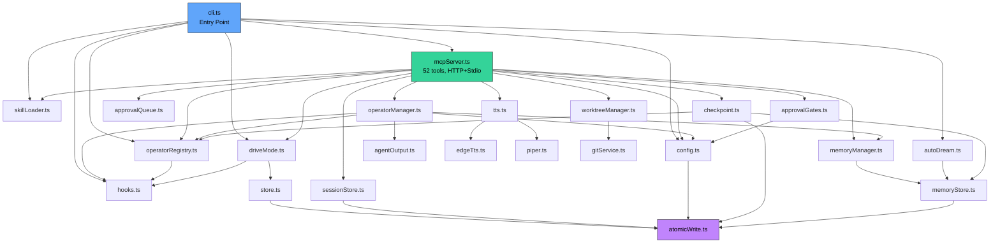

---

## Key Design Decisions

| Decision | Why |
|----------|-----|
| Single atomic write utility | One pattern, no partial writes anywhere |
| AbortController per operator | Clean cancellation on dismiss, including child cascade |
| Memory confidence decay | Old unused knowledge fades naturally; auto-dream prunes it |
| Per-operator throttling | Prevents runaway operators from bypassing safety gates |
| Fail-fast SDK check | Catches missing dependency at startup, not mid-task |
| maxConcurrent limit | Prevents resource exhaustion from unbounded operator spawning |
| Promise-chain mutex for worktrees | Git operations must be serialized; no file-level locks needed |
| Hook exit code 2 = abort | Convention that lets hooks cancel operations without killing the process |
| Skill files as Markdown + YAML | Human-readable, version-controllable prompt templates |

---

## 12. User Journey Map

The end-to-end experience from install to productive daily use. Satisfaction scores highlight friction points.


---

## 13. User-System Interaction Flow

How user intent flows through Claude Code, MCP, and claude-drive — and how feedback returns through terminal output, status line, TTS, and approval prompts.

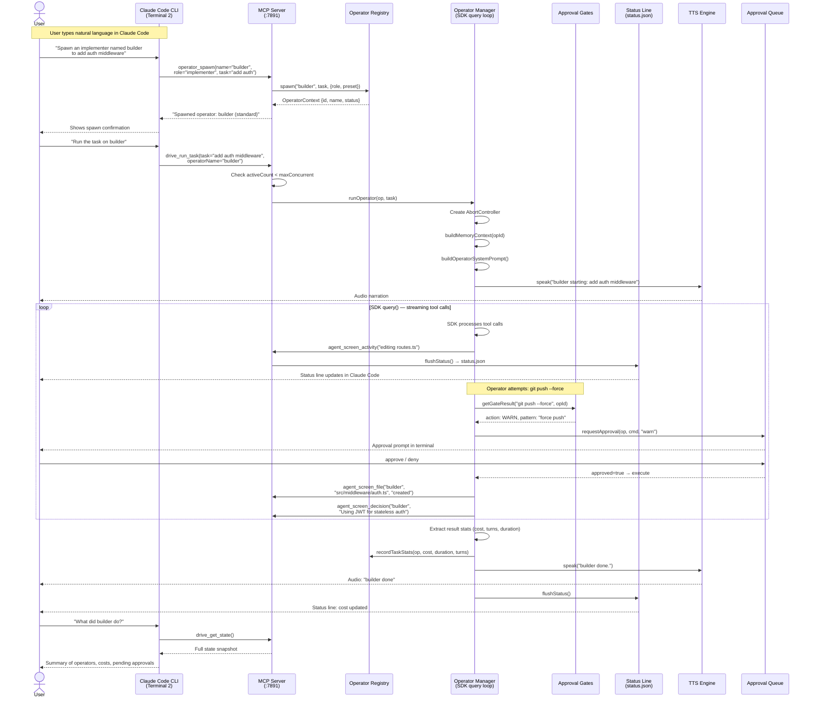

---

## 14. Multi-Operator Workflow Example

A concrete scenario: architect plans, builder implements, reviewer reviews. Shows timeline, worktree branches, and how operators coordinate via shared memory.

### Timeline View

```mermaid
gantt
    title Multi-Operator Workflow: Feature Implementation
    dateFormat X
    axisFormat %s

    section Setup
    claude-drive start (Terminal 1)         :done, t0, 0, 2
    claude (Terminal 2)                     :done, t1, 2, 4

    section Architect (planner, readonly)
    Spawn architect                         :done, a0, 4, 5
    Create worktree drive/op/architect      :done, a1, 5, 7
    Analyze codebase, produce plan          :active, a2, 7, 20
    Plan checkpoint saved                   :milestone, a3, 20, 20
    Dismiss architect                       :done, a4, 20, 21

    section Builder (implementer, standard)
    Spawn builder                           :done, b0, 20, 21
    Create worktree drive/op/builder        :done, b1, 21, 23
    Implement auth middleware               :active, b2, 23, 45
    Implement route guards                  :active, b3, 45, 60
    Safety gate rm -rf triggered            :crit, b4, 50, 52
    User approves after review              :done, b5, 52, 53
    Write tests                             :active, b6, 60, 70
    Builder checkpoint saved                :milestone, b7, 70, 70

    section Reviewer (reviewer, readonly)
    Spawn reviewer                          :done, r0, 70, 71
    Create worktree drive/op/reviewer       :done, r1, 71, 73
    Review builder changes                  :active, r2, 73, 85
    Escalate missing error handling         :crit, r3, 80, 82
    Report findings via agent_screen        :done, r4, 85, 87
    Dismiss reviewer                        :done, r5, 87, 88

    section Integration
    Builder fixes review findings           :active, i1, 88, 95
    Merge builder worktree to main          :done, i2, 95, 97
    Dismiss builder                         :done, i3, 97, 98
    Final session checkpoint                :milestone, i4, 98, 98
```

### Coordination View

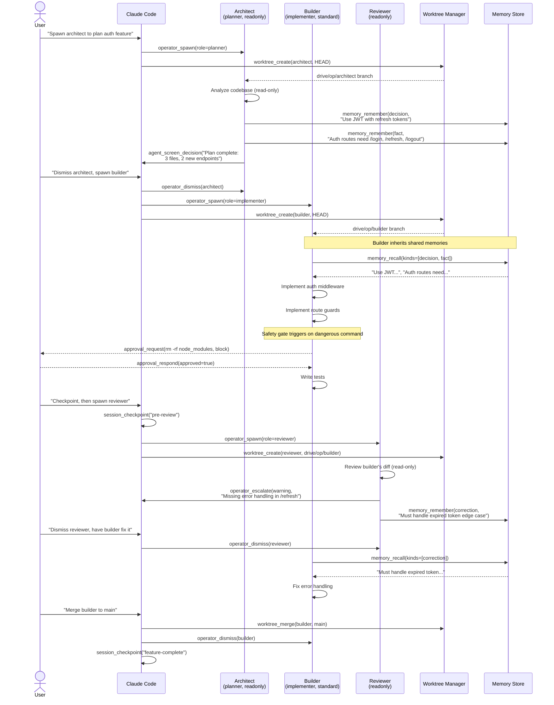

---

## 15. Session Lifecycle

How session state is preserved, checkpointed, forked, and restored.

### State Machine

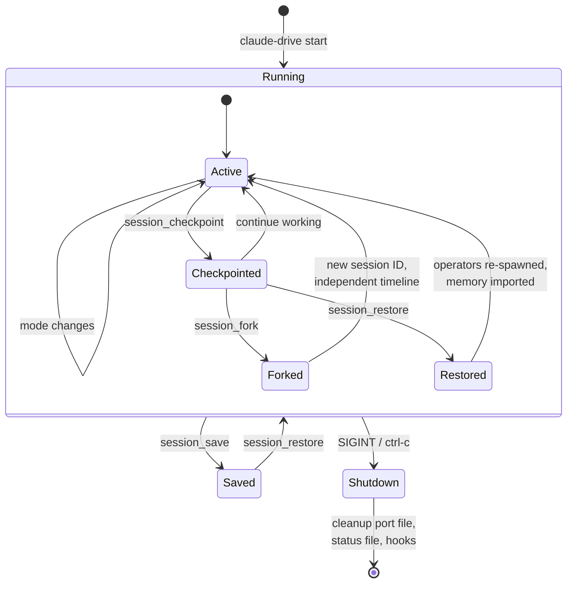

### Checkpoint Data Flow

```mermaid
flowchart TD
    subgraph Create ["Checkpoint Create"]
        CC1["session_checkpoint(name?)"] --> CC2["Snapshot registry.list()"]
        CC1 --> CC3["Snapshot driveMode state"]
        CC1 --> CC4["exportAll() from memoryStore"]
        CC1 --> CC5["Copy activity log"]
        CC2 --> CC6["atomicWriteJSON(<br/>sessions/id/checkpoints/cpId.json)"]
        CC3 --> CC6
        CC4 --> CC6
        CC5 --> CC6
        CC6 --> CC7{"checkpoints > max (20)?"}
        CC7 -->|Yes| CC8["Prune oldest"]
        CC7 -->|No| CC9["Done"]
    end

    subgraph Restore ["Checkpoint Restore"]
        CR1["session_restore(cpId)"] --> CR2["Find checkpoint"]
        CR2 --> CR3["Dismiss all current operators"]
        CR3 --> CR4["Re-spawn from snapshot"]
        CR4 --> CR5["importBulk(checkpoint.memory)"]
        CR5 --> CR6["Restore driveMode state"]
    end

    subgraph Fork ["Session Fork"]
        SF1["session_fork(cpId?, name?)"] --> SF2{"checkpointId?"}
        SF2 -->|Yes| SF3["Find existing checkpoint"]
        SF2 -->|No| SF4["Create checkpoint now"]
        SF3 --> SF5["Generate new session ID"]
        SF4 --> SF5
        SF5 --> SF6["Clone with new sessionId"]
        SF6 --> SF7["metadata: forkedFrom, timestamp"]
        SF7 --> SF8["Write to new session dir"]
    end
```

---

## 16. Status Line & Feedback Channels

The four channels through which the system communicates back to the user during operation.

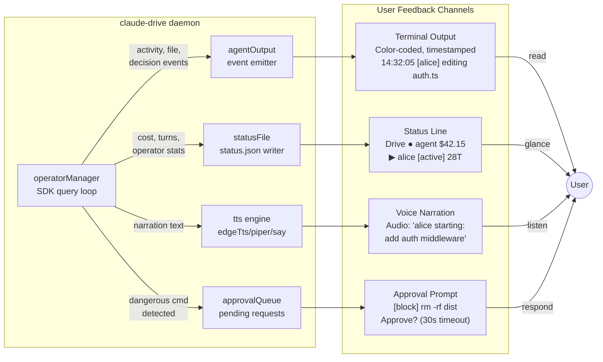
