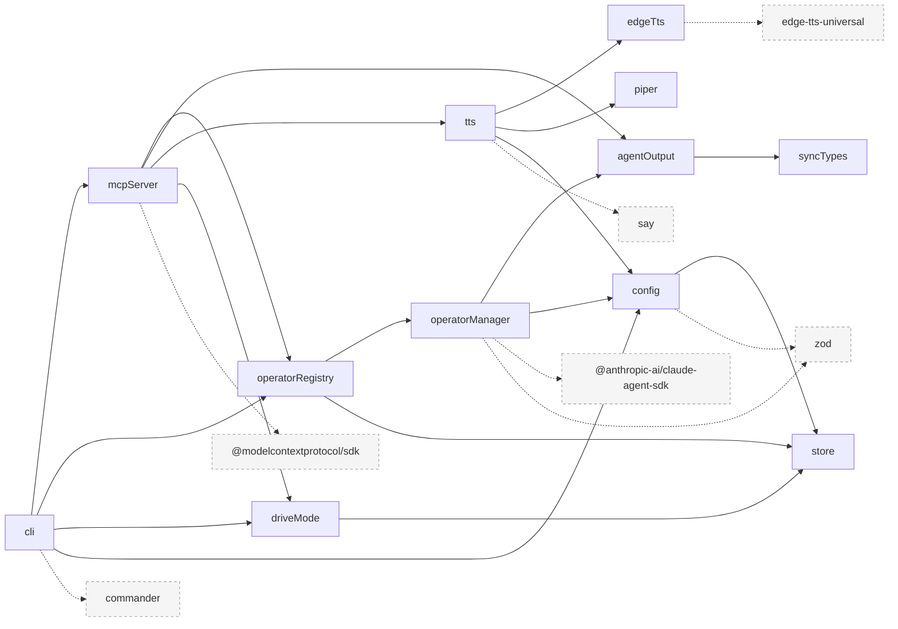
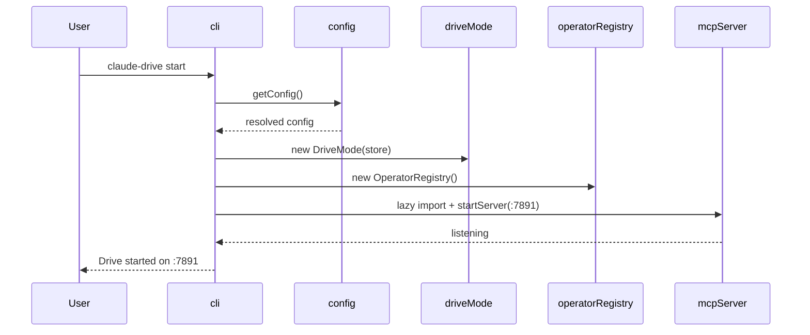
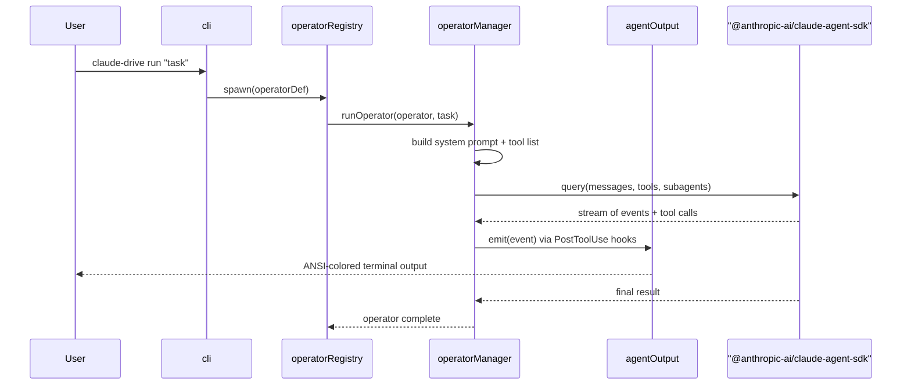
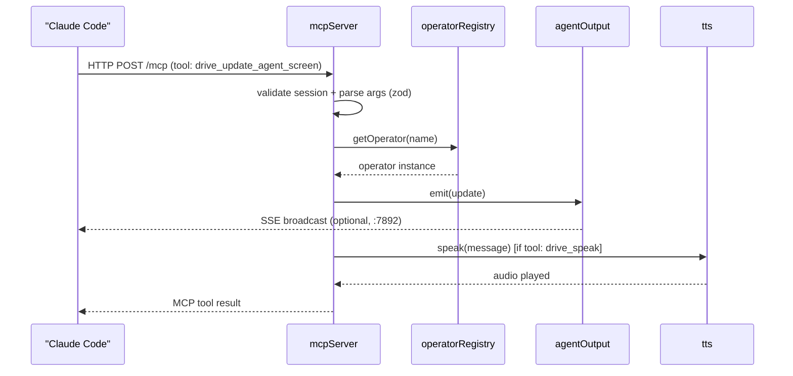
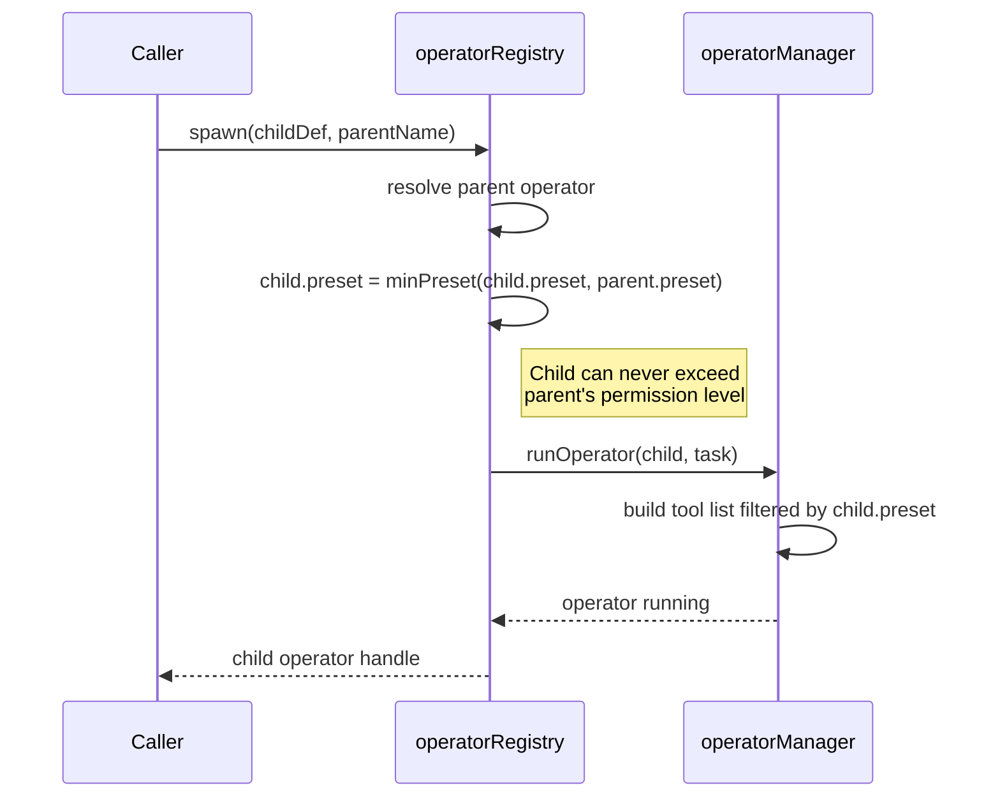

# Architecture

## Overview

Claude Drive is a local CLI daemon that gives Claude Code agents a structured runtime for multi-operator AI pair programming. It exposes an MCP server on `:7891` that Claude Code calls to manage named operators, coordinate state, and speak via TTS — all without any cloud backend or VS Code dependency.

## Module Dependency Graph

## Component Descriptions

| Module | Purpose |
|--------|---------|
| `cli.ts` | Commander CLI entry point; registers all commands (`start`, `run`, `status`, etc.); creates shared `operatorRegistry` and `driveMode` instances |
| `mcpServer.ts` | HTTP MCP server on `:7891`; exposes 14 tools via `@modelcontextprotocol/sdk`; manages sessions via an in-memory `Map` |
| `operatorManager.ts` | Agent SDK wrapper; `runOperator()` calls `query()` from `@anthropic-ai/claude-agent-sdk`; builds system prompts, tool lists, subagent definitions, and `PostToolUse` hooks |
| `operatorRegistry.ts` | In-memory operator pool; lifecycle methods: `spawn`, `switch`, `dismiss`, `pause`, `resume`, `merge`, `delegate`, `escalate`; `minPreset()` for permission inheritance |
| `driveMode.ts` | State machine tracking `active: boolean` and `subMode: DriveSubMode` (`plan | agent | ask | debug`); persists via `store.ts`; fires change events via Node `EventEmitter` |
| `agentOutput.ts` | Terminal ANSI renderer; `AgentOutputEmitter extends EventEmitter`; color-codes output per operator; optionally broadcasts SSE on `:7892` |
| `config.ts` | Layered config loader: CLI flags > `CLAUDE_DRIVE_*` env vars > `~/.claude-drive/config.json` > defaults; exports `getConfig()`, `saveConfig()`, `setFlag()` |
| `store.ts` | Lightweight key-value store backed by a JSON file at `~/.claude-drive/store.json`; used for runtime state persistence across restarts |
| `tts.ts` | TTS orchestrator; `speak()` tries Edge TTS → Piper → `say` fallback in order; reads backend preference from config |
| `edgeTts.ts` | Edge TTS backend using the `edge-tts-universal` package for cloud-free neural voices |
| `piper.ts` | Piper TTS backend invoking a local Piper binary for fully offline synthesis |
| `router.ts` | Intent router stub; placeholder for future voice command classification and dispatch |
| `syncTypes.ts` | Shared TypeScript types for git worktree sync state; imported by modules that coordinate parallel operator isolation |

## Data Flows

### a. `claude-drive start` flow

### b. `claude-drive run "task"` flow

### c. Claude Code → MCP tool call flow

### d. Permission cascade on operator spawn

## Key Design Decisions

- **Local-first, no cloud state** — all state lives in `~/.claude-drive/` JSON files or in-process memory; no telemetry, no external services required.
- **No VS Code dependency** — claude-drive is a pure Node.js CLI; it complements the cursor-drive VS Code extension but runs independently, making it usable from any terminal or CI environment.
- **MCP bridge as the only integration channel** — Claude Code connects exclusively through the MCP server on `:7891`; this keeps the boundary clean and the protocol standard, avoiding any need to hook into Cursor internals.
- **Agent SDK wrapper pattern** — `operatorManager.ts` wraps `@anthropic-ai/claude-agent-sdk` rather than calling it directly from the registry; this isolates prompt engineering, tool construction, and hook wiring in one place and keeps the registry focused on lifecycle management.
- **Permission inheritance via `minPreset()`** — child operators can never exceed their parent's permission preset; this enforces a least-privilege cascade without requiring explicit deny lists.
- **TTS fallback chain** — `tts.ts` tries Edge TTS → Piper → `say` in order so the system degrades gracefully from high-quality neural voices to the OS default synthesizer without configuration changes.
