# claude-drive Architecture

## 1. High-Level System Overview

Claude Code connects via MCP. The daemon orchestrates operators through the SDK, with memory, safety, and persistence layers underneath.

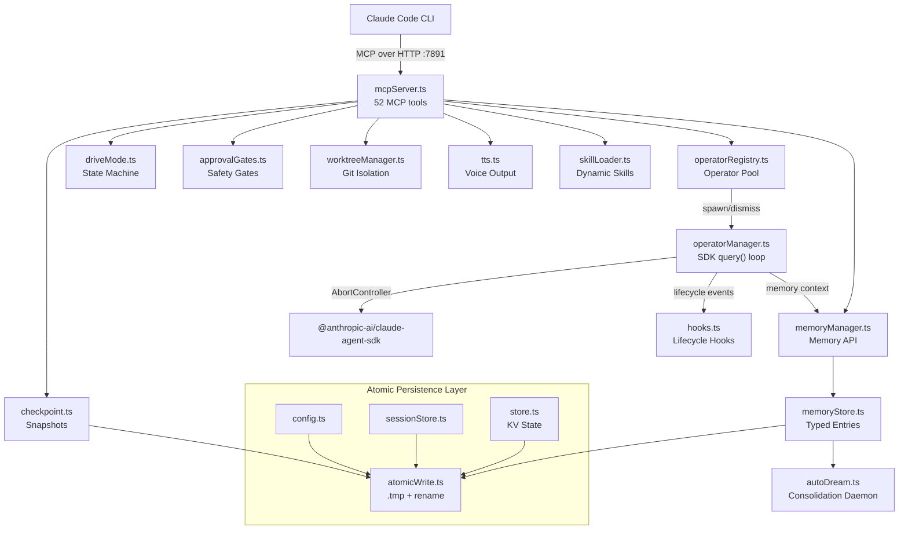

---

## 2. Startup Sequence

Fail-fast SDK validation, then hooks/skills/auto-dream initialization, then MCP server bind.

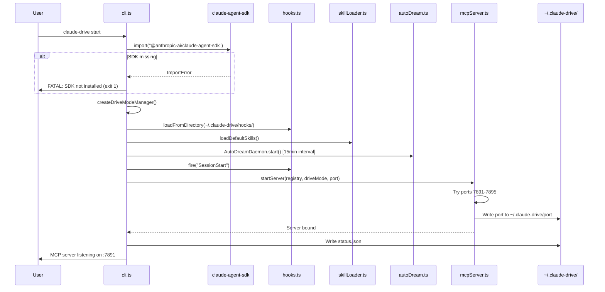

---

## 3. Operator Lifecycle State Machine

Only ONE operator can be Active (foreground) at a time. Dismiss fires AbortController and cascades to children.

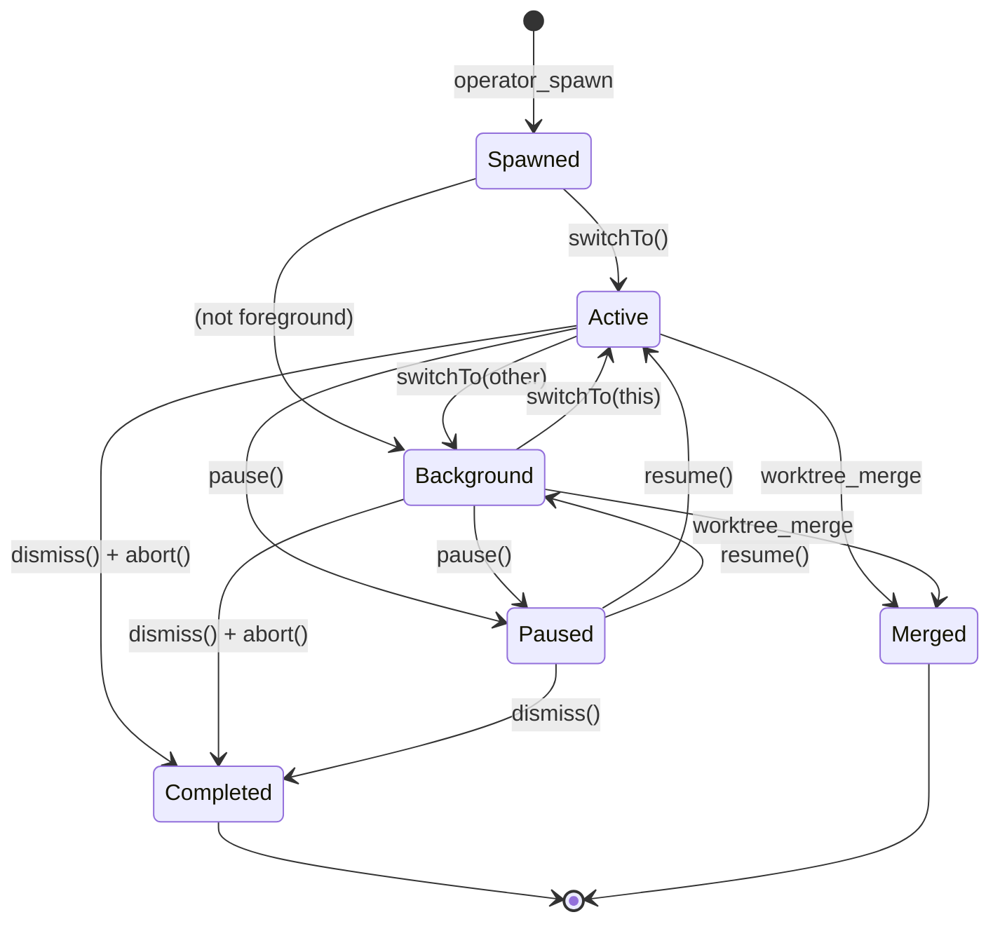

---

## 4. Task Dispatch Flow

MaxConcurrent check, AbortController setup, memory context injection, SDK query loop with cost extraction.

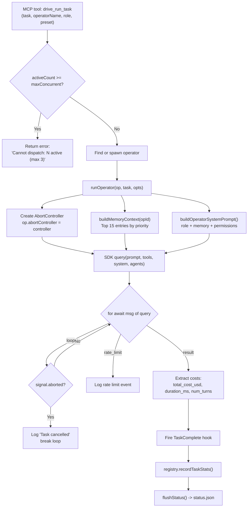

---

## 5. Memory System & Auto-Dream

Typed entries with confidence decay. Auto-dream consolidates every 15 minutes.

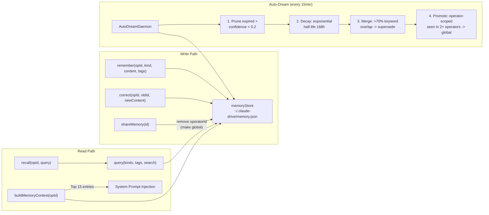

**Memory priority** (for system prompt context): corrections > decisions > facts > preferences > context

---

## 6. Safety & Approval Gates

Pattern-based filtering with per-operator throttling. 3+ blocks or 5+ warnings = operator throttled.

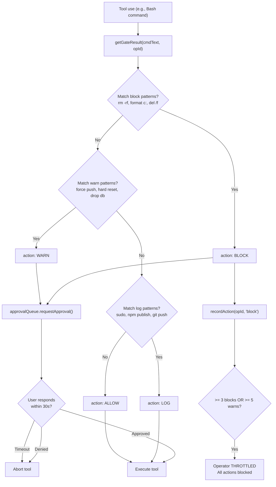

---

## 7. Persistence Architecture

Everything goes through `atomicWriteJSON()` — write to `.tmp`, then `rename`. Atomic on POSIX and NTFS.

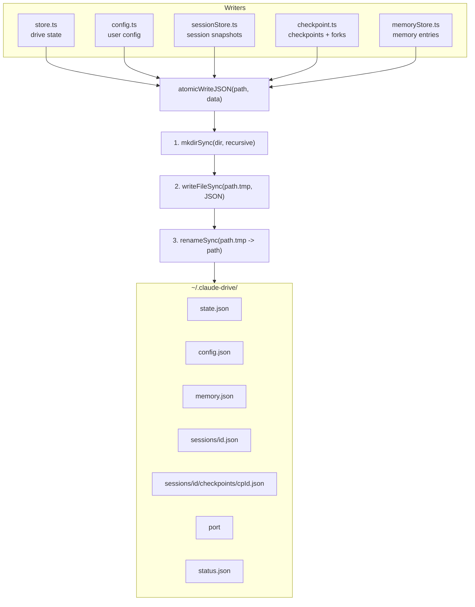

---

## 8. Drive Mode State Machine

Controls behavior mode. Persists to `store.ts`. Fires `ModeChange` hook on transition.

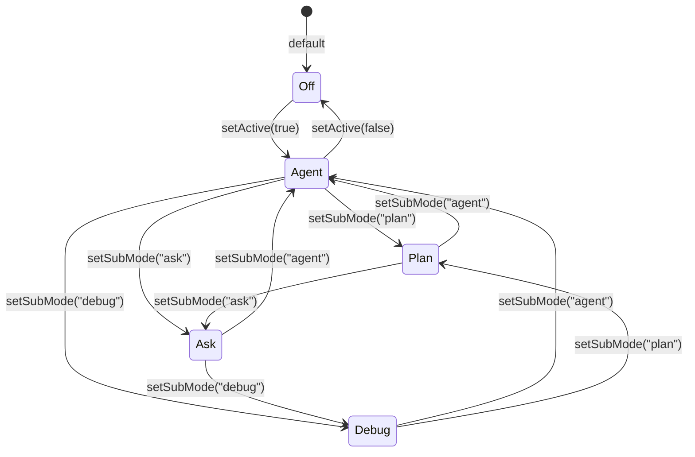

---

## 9. Hook System

9 lifecycle events, filtered by matcher regex, sorted by priority. Exit code 2 = abort operation.

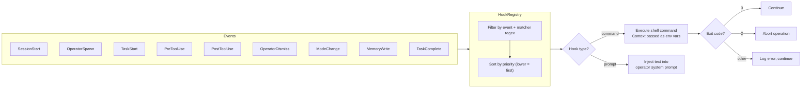

---

## 10. Worktree Isolation

Each operator gets its own git branch and working directory. Promise-chain mutex serializes git ops.

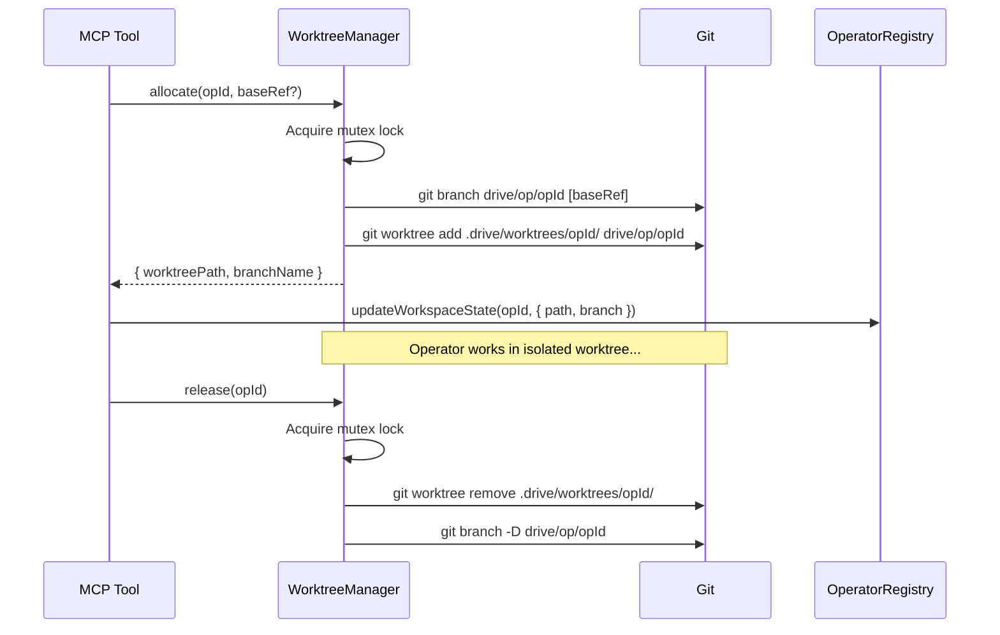

---

## 11. Full Module Dependency Map

Complete import graph across all 28 TypeScript modules. Purple = shared atomic write layer. Blue = entry point. Green = MCP surface.

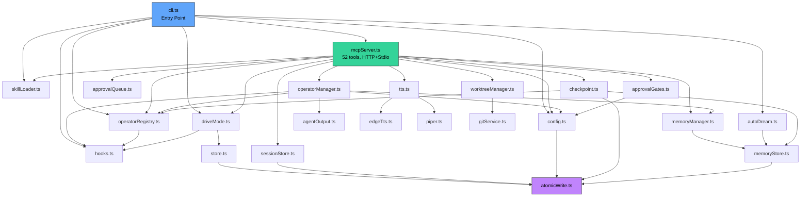

---

## Key Design Decisions

| Decision | Why |
|----------|-----|
| Single atomic write utility | One pattern, no partial writes anywhere |
| AbortController per operator | Clean cancellation on dismiss, including child cascade |
| Memory confidence decay | Old unused knowledge fades naturally; auto-dream prunes it |
| Per-operator throttling | Prevents runaway operators from bypassing safety gates |
| Fail-fast SDK check | Catches missing dependency at startup, not mid-task |
| maxConcurrent limit | Prevents resource exhaustion from unbounded operator spawning |
| Promise-chain mutex for worktrees | Git operations must be serialized; no file-level locks needed |
| Hook exit code 2 = abort | Convention that lets hooks cancel operations without killing the process |
| Skill files as Markdown + YAML | Human-readable, version-controllable prompt templates |

---

## 12. User Journey Map

The end-to-end experience from install to productive daily use. Satisfaction scores highlight friction points.

---

## 13. User-System Interaction Flow

How user intent flows through Claude Code, MCP, and claude-drive — and how feedback returns through terminal output, status line, TTS, and approval prompts.

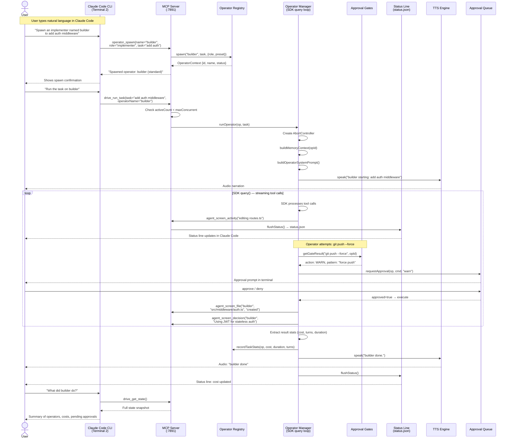

---

## 14. Multi-Operator Workflow Example

A concrete scenario: architect plans, builder implements, reviewer reviews. Shows timeline, worktree branches, and how operators coordinate via shared memory.

### Timeline View

```mermaid
gantt
    title Multi-Operator Workflow: Feature Implementation
    dateFormat X
    axisFormat %s

    section Setup
    claude-drive start (Terminal 1)         :done, t0, 0, 2
    claude (Terminal 2)                     :done, t1, 2, 4

    section Architect (planner, readonly)
    Spawn architect                         :done, a0, 4, 5
    Create worktree drive/op/architect      :done, a1, 5, 7
    Analyze codebase, produce plan          :active, a2, 7, 20
    Plan checkpoint saved                   :milestone, a3, 20, 20
    Dismiss architect                       :done, a4, 20, 21

    section Builder (implementer, standard)
    Spawn builder                           :done, b0, 20, 21
    Create worktree drive/op/builder        :done, b1, 21, 23
    Implement auth middleware               :active, b2, 23, 45
    Implement route guards                  :active, b3, 45, 60
    Safety gate rm -rf triggered            :crit, b4, 50, 52
    User approves after review              :done, b5, 52, 53
    Write tests                             :active, b6, 60, 70
    Builder checkpoint saved                :milestone, b7, 70, 70

    section Reviewer (reviewer, readonly)
    Spawn reviewer                          :done, r0, 70, 71
    Create worktree drive/op/reviewer       :done, r1, 71, 73
    Review builder changes                  :active, r2, 73, 85
    Escalate missing error handling         :crit, r3, 80, 82
    Report findings via agent_screen        :done, r4, 85, 87
    Dismiss reviewer                        :done, r5, 87, 88

    section Integration
    Builder fixes review findings           :active, i1, 88, 95
    Merge builder worktree to main          :done, i2, 95, 97
    Dismiss builder                         :done, i3, 97, 98
    Final session checkpoint                :milestone, i4, 98, 98
```

### Coordination View

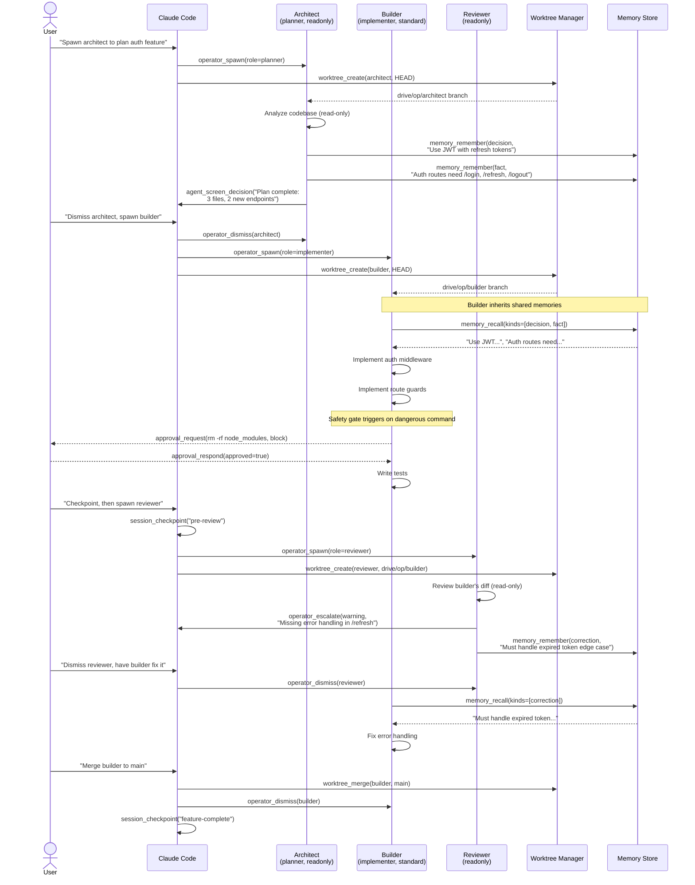

---

## 15. Session Lifecycle

How session state is preserved, checkpointed, forked, and restored.

### State Machine

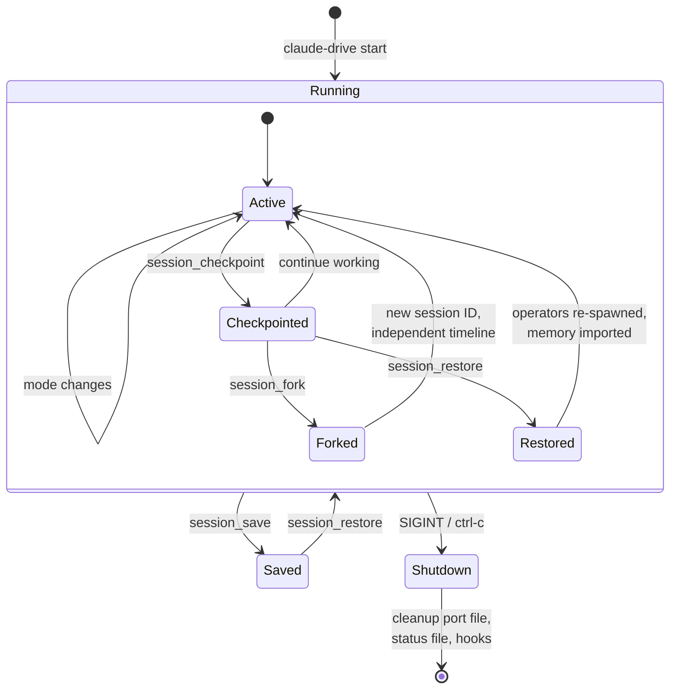

### Checkpoint Data Flow

```mermaid
flowchart TD
    subgraph Create ["Checkpoint Create"]
        CC1["session_checkpoint(name?)"] --> CC2["Snapshot registry.list()"]
        CC1 --> CC3["Snapshot driveMode state"]
        CC1 --> CC4["exportAll() from memoryStore"]
        CC1 --> CC5["Copy activity log"]
        CC2 --> CC6["atomicWriteJSON(<br/>sessions/id/checkpoints/cpId.json)"]
        CC3 --> CC6
        CC4 --> CC6
        CC5 --> CC6
        CC6 --> CC7{"checkpoints > max (20)?"}
        CC7 -->|Yes| CC8["Prune oldest"]
        CC7 -->|No| CC9["Done"]
    end

    subgraph Restore ["Checkpoint Restore"]
        CR1["session_restore(cpId)"] --> CR2["Find checkpoint"]
        CR2 --> CR3["Dismiss all current operators"]
        CR3 --> CR4["Re-spawn from snapshot"]
        CR4 --> CR5["importBulk(checkpoint.memory)"]
        CR5 --> CR6["Restore driveMode state"]
    end

    subgraph Fork ["Session Fork"]
        SF1["session_fork(cpId?, name?)"] --> SF2{"checkpointId?"}
        SF2 -->|Yes| SF3["Find existing checkpoint"]
        SF2 -->|No| SF4["Create checkpoint now"]
        SF3 --> SF5["Generate new session ID"]
        SF4 --> SF5
        SF5 --> SF6["Clone with new sessionId"]
        SF6 --> SF7["metadata: forkedFrom, timestamp"]
        SF7 --> SF8["Write to new session dir"]
    end
```

---

## 16. Status Line & Feedback Channels

The four channels through which the system communicates back to the user during operation.

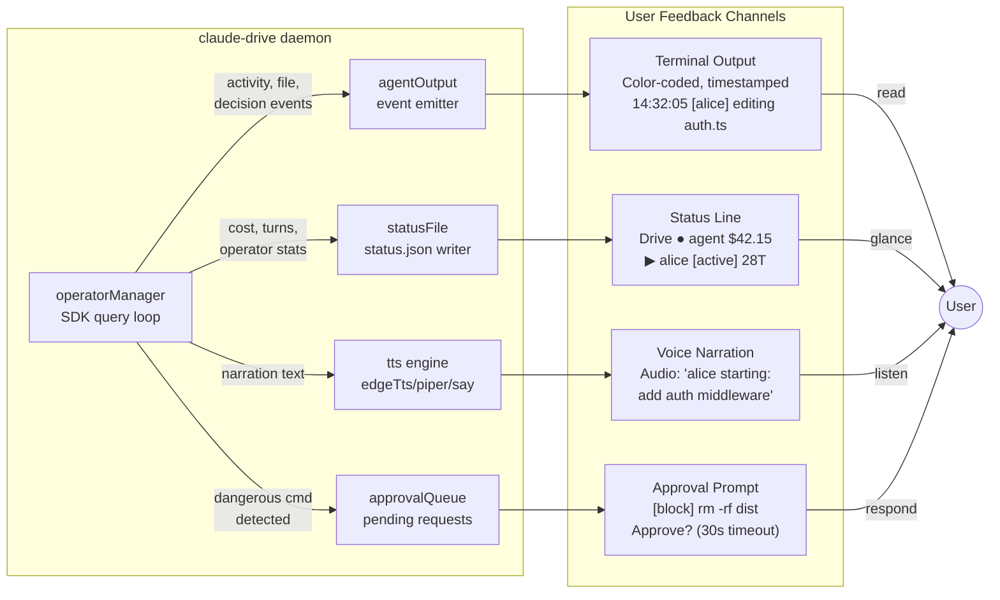
