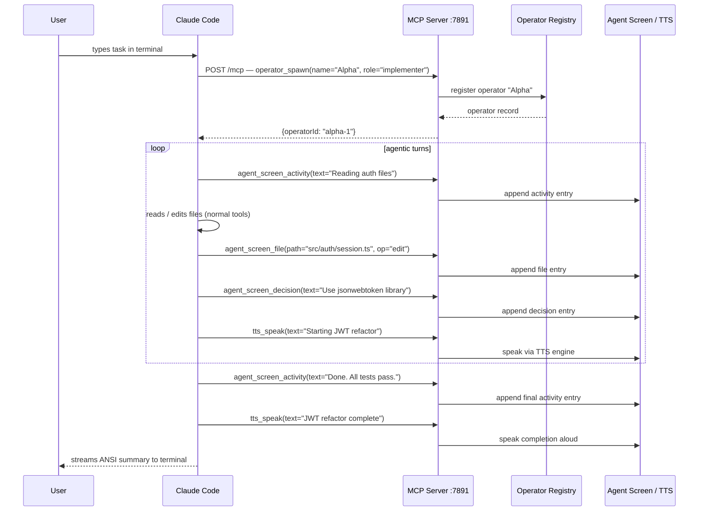

# Claude Code Integration

This document explains how to integrate Claude Code CLI with claude-drive to get voice-first, multi-operator AI pair programming in your terminal.

See also: [operators](./operators.md) | [mcp-tools](./mcp-tools.md) | [CLI reference](./cli-reference.md)

---

## Overview

claude-drive exposes a local MCP server at `http://localhost:7891/mcp`. Claude Code connects to this server and calls its 14 tools to manage operators, update the agent screen, speak via TTS, and coordinate multi-agent sessions. All state is local — there is no cloud backend.

There are two integration patterns:

| Pattern | Who drives | When to use |
|---------|-----------|-------------|
| **A: MCP server mode** | Claude Code | You want Claude Code to manage its own session and call MCP tools explicitly |
| **B: Automated run mode** | claude-drive | You want a one-command hands-off run with hooks and system prompt injection |

---

## Prerequisites

- **claude-drive** installed and the Cursor Drive extension active in VS Code or Cursor (the extension must be running for the MCP server to be available on `:7891`)
- **Claude Code CLI** installed (`npm install -g @anthropic-ai/claude-code` or see the Claude Code docs)
- The extension activated: press `Ctrl+Shift+D` in VS Code/Cursor, or confirm the status bar shows `Drive`

---

## settings.json setup

Add the claude-drive MCP server to your global Claude Code settings so it is discovered automatically in every session.

File location: `~/.claude/settings.json`

```json
{
  "mcpServers": {
    "claude-drive": {
      "url": "http://localhost:7891/mcp"
    }
  }
}
```

After saving, Claude Code will connect to the MCP server on startup and list the available tools. You can verify with:

```bash
claude mcp list
```

You should see `claude-drive` with 14 tools listed.

---

## Pattern A: MCP server mode

In this pattern you run the MCP server and then start a normal Claude Code session. Claude Code's AI decides when to call MCP tools to report progress, speak updates, and manage operators. This is the "headless" pattern — claude-drive provides the UI and coordination layer while Claude Code does the work.

### Step 1 — Start the MCP server

```bash
claude-drive start
```

This starts the HTTP server on `:7891` and keeps it running. Leave this terminal open.

### Step 2 — Open Claude Code in your project

```bash
cd ~/my-project
claude
```

Claude Code connects to the MCP server on startup (because of `settings.json`).

### Step 3 — Work normally

Type your task. Claude Code will use claude-drive MCP tools alongside its normal tools. Example terminal session:

```
> Refactor the auth module to use JWT

claude-drive ▸ operator_spawn — spawning operator "Alpha" (implementer)
claude-drive ▸ agent_screen_activity — "Reading auth module files"
claude-drive ▸ agent_screen_file — src/auth/session.ts [read]
claude-drive ▸ agent_screen_file — src/auth/jwt.ts [read]
claude-drive ▸ agent_screen_activity — "Planning JWT migration"
claude-drive ▸ agent_screen_decision — "Use jsonwebtoken library; keep refresh token in httpOnly cookie"
claude-drive ▸ tts_speak — "Starting JWT refactor on auth module"
claude-drive ▸ agent_screen_file — src/auth/session.ts [edit]
claude-drive ▸ agent_screen_activity — "Writing tests for new JWT flow"
claude-drive ▸ agent_screen_file — tests/auth.test.ts [edit]
claude-drive ▸ agent_screen_activity — "Done. 3 files changed, all tests pass."
claude-drive ▸ tts_speak — "JWT refactor complete"
```

The agent screen panel in VS Code/Cursor updates in real time showing all activity, files touched, and decisions made.

---

## Pattern B: Automated run mode

In this pattern, claude-drive spawns an operator and runs Claude Code as a managed subprocess using the `@anthropic-ai/claude-agent-sdk`. Hooks automatically intercept Edit, Write, and Bash tool calls to log them to the agent screen. You get a system prompt injected that tells Claude Code its operator role and which MCP tools to use.

### Running a task

```bash
claude-drive run "refactor the auth module to use JWT"
```

Options:

```bash
claude-drive run "task" --operator Alpha --role implementer --preset standard --cwd ./src
```

| Option | Default | Description |
|--------|---------|-------------|
| `--operator` | `Alpha` | Operator name shown in agent screen |
| `--role` | `implementer` | Role hint injected into system prompt |
| `--preset` | `standard` | Tool permission preset (see below) |
| `--cwd` | process cwd | Working directory for Claude Code |
| `--max-turns` | `50` | Maximum agentic turns before stopping |

### What happens internally

1. claude-drive calls `operatorManager.buildOperatorSystemPrompt()` to build a system prompt that tells Claude Code its name, role, and which MCP tools to use for reporting.
2. claude-drive calls `query()` from `@anthropic-ai/claude-agent-sdk` with the task, system prompt, allowed tools, and MCP server config.
3. The Agent SDK manages Claude Code as a subprocess, streaming its output back to the terminal.
4. A `PostToolUse` hook fires on every Edit, Write, and Bash call and logs it to the agent screen via the MCP server.
5. Claude Code's responses stream to your terminal as ANSI output.

### System prompt injected (Pattern B)

```
You are operator "Alpha" in a multi-agent coding session.
Your role: implementer.
[role system hint]
[memory entries]
Use the claude-drive MCP tools to report progress:
  agent_screen_activity — log what you are doing
  agent_screen_file     — log files you touch
  agent_screen_decision — log key decisions
  tts_speak             — speak important updates aloud
```

### Tool permission presets

| Preset | Allowed tools |
|--------|---------------|
| `readonly` | Read, Glob, Grep, WebSearch, WebFetch |
| `standard` | + Edit, Write, Bash, Agent |
| `full` | same as standard |

---

## Full workflow sequence diagram



---

## Multi-operator workflow

You can spawn multiple operators for different roles and have them coordinate through the registry.

### Example: implementer + reviewer

```bash
# Terminal 1 — start the server
claude-drive start

# Terminal 2 — spawn the implementer
claude-drive run "implement the JWT auth refactor" --operator Alpha --role implementer

# Terminal 3 — spawn the reviewer once Alpha is done
claude-drive run "review Alpha's JWT changes and write a summary" --operator Beta --role reviewer
```

Or from inside a Claude Code session (Pattern A), call the MCP tools directly:

```
> Spawn an implementer to do the JWT refactor and a reviewer to check it

claude-drive ▸ operator_spawn — name="Alpha", role="implementer"
claude-drive ▸ operator_spawn — name="Beta", role="reviewer", status=background
claude-drive ▸ operator_switch — switching to Alpha
claude-drive ▸ agent_screen_activity — "Alpha: implementing JWT auth"
...
claude-drive ▸ operator_switch — switching to Beta
claude-drive ▸ agent_screen_activity — "Beta: reviewing Alpha's changes"
claude-drive ▸ agent_screen_decision — "Beta: changes are safe to merge"
claude-drive ▸ tts_speak — "Review complete. Ready to merge."
```

The agent screen panel shows both operators' activity feeds, color-coded by operator name. The status bar updates to show the active operator.

See [operators](./operators.md) for the full operator lifecycle and delegation model.

---

## Tips

- **Keep TTS on** — spoken updates let you stay focused on other work while Claude Code runs in the background. Use `--preset readonly` for review-only tasks to prevent accidental edits.
- **Use operator roles** — the `implementer`, `reviewer`, `planner`, and `debugger` roles inject role-specific hints into the system prompt, improving task focus.
- **Add to a startup script** — if you always want the MCP server running, add `claude-drive start &` to your shell profile or a `tmux`/`screen` session startup.
- **Check the agent screen** — open the agent screen panel (`Ctrl+Shift+D` then choose Agent Screen) to see a live feed of all operators' activity, files touched, and decisions made — even when Claude Code is running headlessly in a separate terminal.
- **Memory persists across runs** — each named operator accumulates memory entries. Reusing the same operator name (e.g., `--operator Alpha`) across sessions gives the operator context about past decisions. Use `operator_memory_add` and `operator_memory_list` via MCP tools to inspect or seed memory manually.
