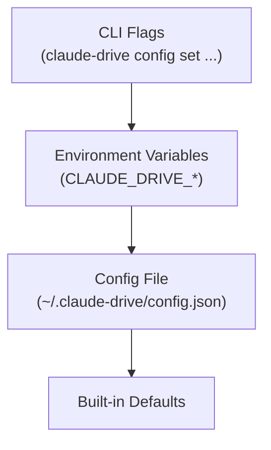

# Configuration

## Overview

Claude Drive reads configuration from three sources — CLI flags, environment variables, and a JSON file — merging them at startup so each layer can selectively override the layer below it. The config file lives at `~/.claude-drive/config.json` and is the primary place to persist settings across sessions. Values are validated and clamped at load time so the running process always operates within safe bounds.

## Priority Pyramid

Higher layers override lower layers. A value present at any level shadows every level beneath it.



## Config File Location

The config file is read from `~/.claude-drive/config.json`. If it does not exist, all built-in defaults apply.

To create it:

```bash
mkdir -p ~/.claude-drive
touch ~/.claude-drive/config.json
```

Then open it in your editor and add a JSON object. Any key you omit will fall back to its default value.

## Environment Variable Format

Every config key maps to an environment variable with the `CLAUDE_DRIVE_` prefix. Dots in the key name become underscores and the key is uppercased.

| Config key | Environment variable |
|---|---|
| `tts.backend` | `CLAUDE_DRIVE_TTS_BACKEND` |
| `tts.voice` | `CLAUDE_DRIVE_TTS_VOICE` |
| `operators.maxConcurrent` | `CLAUDE_DRIVE_OPERATORS_MAXCONCURRENT` |
| `mcp.port` | `CLAUDE_DRIVE_MCP_PORT` |

Example — override the TTS backend for a single session without editing the config file:

```bash
CLAUDE_DRIVE_TTS_BACKEND=piper claude-drive
```

## Config Reference

### TTS

| Key | Default | Type | Description |
|---|---|---|---|
| `tts.enabled` | `true` | boolean | Enable or disable all TTS output. |
| `tts.backend` | `"edgeTts"` | `"edgeTts" \| "piper" \| "say"` | TTS engine to use. See [TTS setup](./tts-setup.md). |
| `tts.voice` | `undefined` | string | Voice name passed to the backend. Backend-specific; omit to use the backend's default. |
| `tts.speed` | `1.0` | number (0.5–2.0) | Playback speed multiplier. Clamped to the 0.5–2.0 range at load time. |
| `tts.volume` | `0.8` | number (0.2–1.0) | Output volume. Clamped to the 0.2–1.0 range at load time. |
| `tts.maxSpokenSentences` | `3` | integer | Maximum number of sentences spoken per utterance before truncation. |
| `tts.interruptOnInput` | `true` | boolean | Stop current speech when new input arrives. |
| `tts.piperBinaryPath` | `undefined` | string | Absolute path to the `piper` binary. Required when `tts.backend` is `"piper"`. |
| `tts.piperModelPath` | `undefined` | string | Absolute path to the piper `.onnx` voice model file. Required when `tts.backend` is `"piper"`. |

### Operators

| Key | Default | Type | Description |
|---|---|---|---|
| `operators.maxConcurrent` | `3` | integer | Maximum number of operators that can be active at the same time. |
| `operators.maxSubagents` | `2` | integer | Maximum subagents each operator may spawn. |
| `operators.namePool` | `["Alpha","Beta","Gamma","Delta","Echo","Foxtrot"]` | string[] | Names automatically assigned to new operators in order. |
| `operators.defaultPermissionPreset` | `"standard"` | string | Permission preset applied to new operators. |

### MCP

| Key | Default | Type | Description |
|---|---|---|---|
| `mcp.port` | `7891` | integer | Port the local MCP server listens on. |
| `mcp.appsEnabled` | `false` | boolean | Enable MCP apps support (reserved for future use). |

### Agent Screen

| Key | Default | Type | Description |
|---|---|---|---|
| `agentScreen.mode` | `"terminal"` | `"terminal" \| "web"` | Render the agent screen in the terminal or as a web dashboard. |
| `agentScreen.webPort` | `7892` | integer | Port for the web dashboard. Only used when `agentScreen.mode` is `"web"`. |

### Drive

| Key | Default | Type | Description |
|---|---|---|---|
| `drive.defaultMode` | `"agent"` | string | Sub-mode activated on startup (`plan`, `agent`, `ask`, or `debug`). |
| `drive.confirmGates` | `true` | boolean | Require confirmation before dangerous operations. Disable only in fully automated pipelines. |

### Voice

| Key | Default | Type | Description |
|---|---|---|---|
| `voice.enabled` | `false` | boolean | Enable microphone / voice input. |
| `voice.wakeWord` | `"hey drive"` | string | Phrase that activates the microphone. |
| `voice.sleepWord` | `"go to sleep"` | string | Phrase that deactivates the microphone. |
| `voice.whisperPath` | `undefined` | string | Absolute path to the `whisper` binary used for transcription. |

### Privacy

| Key | Default | Type | Description |
|---|---|---|---|
| `privacy.persistTranscripts` | `false` | boolean | Write voice transcripts to disk. Disabled by default to avoid storing sensitive speech data locally. |

## CLI Commands

Use `claude-drive config` to read and write individual keys without editing the JSON file directly. Changes made via `config set` persist to `~/.claude-drive/config.json`. See [CLI reference](./cli-reference.md) for the full command list.

```bash
# Read a value
claude-drive config get tts.backend

# Set a value
claude-drive config set tts.backend piper

# Set the piper binary path
claude-drive config set tts.piperBinaryPath /usr/local/bin/piper

# Enable voice input
claude-drive config set voice.enabled true
```

## Example Config Files

### Minimal — TTS only

Override only the TTS backend; everything else uses defaults.

```json
{
  "tts": {
    "backend": "edgeTts",
    "speed": 1.2,
    "volume": 0.9
  }
}
```

### Power User — custom operators and voice enabled

```json
{
  "tts": {
    "backend": "piper",
    "piperBinaryPath": "/usr/local/bin/piper",
    "piperModelPath": "/home/user/.local/share/piper/en_US-amy-medium.onnx",
    "speed": 1.1,
    "volume": 1.0,
    "maxSpokenSentences": 5,
    "interruptOnInput": true
  },
  "operators": {
    "maxConcurrent": 5,
    "maxSubagents": 3,
    "namePool": ["Apex", "Bolt", "Cobalt", "Drift", "Echo"],
    "defaultPermissionPreset": "standard"
  },
  "mcp": {
    "port": 7891
  },
  "agentScreen": {
    "mode": "web",
    "webPort": 7892
  },
  "drive": {
    "defaultMode": "agent",
    "confirmGates": true
  },
  "voice": {
    "enabled": true,
    "wakeWord": "hey drive",
    "sleepWord": "go to sleep",
    "whisperPath": "/usr/local/bin/whisper"
  },
  "privacy": {
    "persistTranscripts": false
  }
}
```

## Validation

`tts.speed` and `tts.volume` are clamped at load time inside `src/tts.ts`. Values outside the allowed range are silently adjusted rather than rejected, so the process always starts:

- `tts.speed` is clamped to **0.5–2.0** (values below 0.5 become 0.5; values above 2.0 become 2.0).
- `tts.volume` is clamped to **0.2–1.0** (values below 0.2 become 0.2; values above 1.0 become 1.0).

All other fields that fall outside an expected range will surface a warning in the startup log but will not prevent the process from starting.
