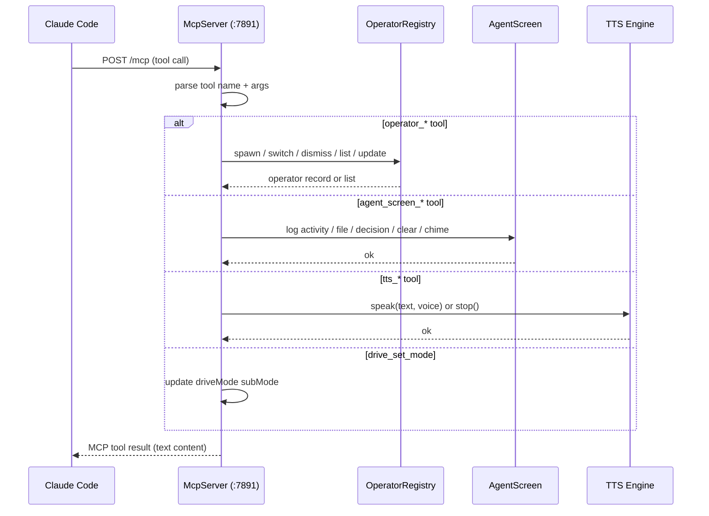

# MCP Tools Reference

This document describes the 14 MCP tools exposed by the Cursor Drive extension's local MCP server. Claude Code connects to this server to update the extension UI, manage operators, control TTS, and coordinate multi-agent sessions.

## Overview

The Cursor Drive extension runs a local MCP server at `http://localhost:7891/mcp`. Claude Code registers it as an MCP server and calls its tools during agentic sessions. There is no cloud backend — all state is local and in-process with the VS Code/Cursor extension.

The server implements the MCP StreamableHTTP transport:

- **POST** `/mcp` — create or resume a session (sends `mcp-session-id` header in response)
- **GET** `/mcp` — open an SSE stream to receive server-sent events for the session
- **DELETE** `/mcp` — close the session

Session identity is tracked via the `mcp-session-id` request header. The server creates a new session for each unique ID it has not seen before.

## Setup

Add the server to `~/.claude/settings.json` so Claude Code discovers it automatically:

```json
{
  "mcpServers": {
    "claude-drive": {
      "url": "http://localhost:7891/mcp"
    }
  }
}
```

The Cursor Drive extension must be active in VS Code/Cursor before Claude Code attempts to connect. The extension starts the server on activation (default shortcut: `Ctrl+Shift+D`).

## Request / Response Flow



## Tool Reference

### Operator Tools

These tools manage the named-operator pool. See [operators](./operators.md) for the full operator lifecycle.

| Tool | Description | Parameters | Returns |
|------|-------------|------------|---------|
| `operator_spawn` | Spawn a new named operator and make it active | `name?: string` — display name (auto-generated if omitted)<br>`task?: string` — initial task description<br>`role?: "implementer"\|"reviewer"\|"tester"\|"researcher"\|"planner"` — operator role<br>`preset?: "readonly"\|"standard"\|"full"` — permission preset | Confirmation string with operator name and ID |
| `operator_switch` | Switch the active operator | `nameOrId: string` — operator name or ID _(required)_ | Confirmation string with switched-to operator name |
| `operator_dismiss` | Dismiss (remove) an operator from the pool | `nameOrId: string` — operator name or ID _(required)_ | Confirmation string |
| `operator_list` | List all active operators | _(none)_ | JSON array of operator records |
| `operator_update_task` | Replace an operator's current task description | `nameOrId: string` — operator name or ID _(required)_<br>`task: string` — new task text _(required)_ | Confirmation string |
| `operator_update_memory` | Append a timestamped note to an operator's memory log | `nameOrId: string` — operator name or ID _(required)_<br>`entry: string` — note text _(required)_ | Confirmation string |

### Agent Screen Tools

These tools write to the S-AS (Supplemental Agent Screen) webview panel. Use them to give the human operator a live feed of what is happening.

| Tool | Description | Parameters | Returns |
|------|-------------|------------|---------|
| `agent_screen_activity` | Log a free-text activity message | `agent: string` — operator/agent name _(required)_<br>`text: string` — message text _(required)_ | `"ok"` |
| `agent_screen_file` | Log a file touch (read, write, delete, etc.) | `agent: string` — operator/agent name _(required)_<br>`path: string` — file path _(required)_<br>`action?: string` — e.g. `"read"`, `"write"`, `"delete"` | `"ok"` |
| `agent_screen_decision` | Log a decision or reasoning note | `agent: string` — operator/agent name _(required)_<br>`text: string` — decision text _(required)_ | `"ok"` |
| `agent_screen_clear` | Clear all entries from the agent screen | _(none)_ | `"ok"` |
| `agent_screen_chime` | Play a named chime notification sound | `name?: string` — chime name (uses default chime if omitted) | `"ok"` |

### TTS Tools

These tools control the local TTS engine. See [configuration](./configuration.md) for backend selection (say.js, Edge-TTS, Piper).

| Tool | Description | Parameters | Returns |
|------|-------------|------------|---------|
| `tts_speak` | Speak text aloud through the configured TTS backend | `text: string` — text to speak _(required)_<br>`voice?: string` — voice name (backend-specific) | `"ok"` |
| `tts_stop` | Stop any TTS audio that is currently playing | _(none)_ | `"ok"` |

### Drive Mode Tool

| Tool | Description | Parameters | Returns |
|------|-------------|------------|---------|
| `drive_set_mode` | Set the Drive sub-mode, updating the status bar and sidebar | `mode: "plan"\|"agent"\|"ask"\|"debug"\|"off"` _(required)_ | Confirmation string with new mode |

## Usage Examples

### Operator Tools

Spawn a named implementer operator:

```json
{
  "tool": "operator_spawn",
  "arguments": {
    "name": "Aria",
    "task": "Refactor the TTS engine abstraction",
    "role": "implementer",
    "preset": "standard"
  }
}
```

Switch to an existing operator by name:

```json
{
  "tool": "operator_switch",
  "arguments": {
    "nameOrId": "Aria"
  }
}
```

Append a memory note to an operator:

```json
{
  "tool": "operator_update_memory",
  "arguments": {
    "nameOrId": "Aria",
    "entry": "Decided to keep say.js as the fallback backend for offline support."
  }
}
```

List all active operators (no arguments):

```json
{
  "tool": "operator_list",
  "arguments": {}
}
```

### Agent Screen Tools

Log an activity message:

```json
{
  "tool": "agent_screen_activity",
  "arguments": {
    "agent": "Aria",
    "text": "Scanning src/tts.ts for backend interface inconsistencies"
  }
}
```

Log a file touch:

```json
{
  "tool": "agent_screen_file",
  "arguments": {
    "agent": "Aria",
    "path": "src/tts.ts",
    "action": "write"
  }
}
```

Log a decision:

```json
{
  "tool": "agent_screen_decision",
  "arguments": {
    "agent": "Aria",
    "text": "Using a strategy pattern so each TTS backend is swappable at runtime without restarting the extension."
  }
}
```

Play a chime when a long task completes:

```json
{
  "tool": "agent_screen_chime",
  "arguments": {
    "name": "done"
  }
}
```

### TTS Tools

Speak a status update:

```json
{
  "tool": "tts_speak",
  "arguments": {
    "text": "Refactor complete. All tests passing.",
    "voice": "en-US-AriaNeural"
  }
}
```

Stop speech mid-utterance:

```json
{
  "tool": "tts_stop",
  "arguments": {}
}
```

### Drive Mode Tool

Enter plan mode before outlining an approach:

```json
{
  "tool": "drive_set_mode",
  "arguments": {
    "mode": "plan"
  }
}
```

Switch to agent mode when executing:

```json
{
  "tool": "drive_set_mode",
  "arguments": {
    "mode": "agent"
  }
}
```

## Error Handling

When a tool call targets an operator that does not exist (by name or ID), the server returns an MCP result with `isError: true` and a descriptive message in the content array:

```json
{
  "content": [
    {
      "type": "text",
      "text": "Operator not found: \"Aria\""
    }
  ],
  "isError": true
}
```

Callers should check `isError` before using the result. Spawning a new operator with `operator_spawn` and then retrying is the standard recovery path when a target operator has been dismissed.

## Related Docs

- [operators](./operators.md) — operator lifecycle, roles, and permission presets
- [configuration](./configuration.md) — extension settings including TTS backend selection and MCP server port
