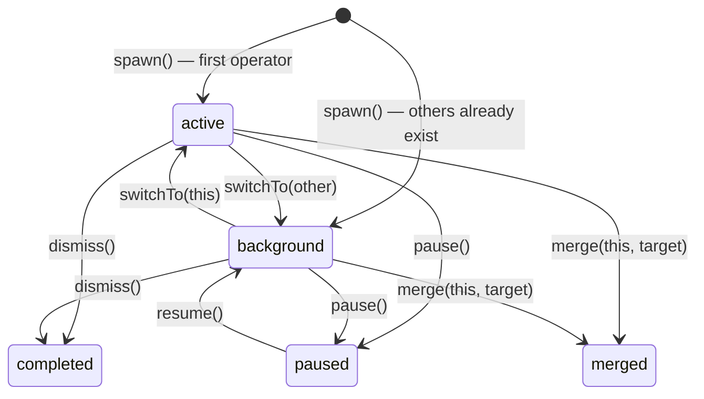
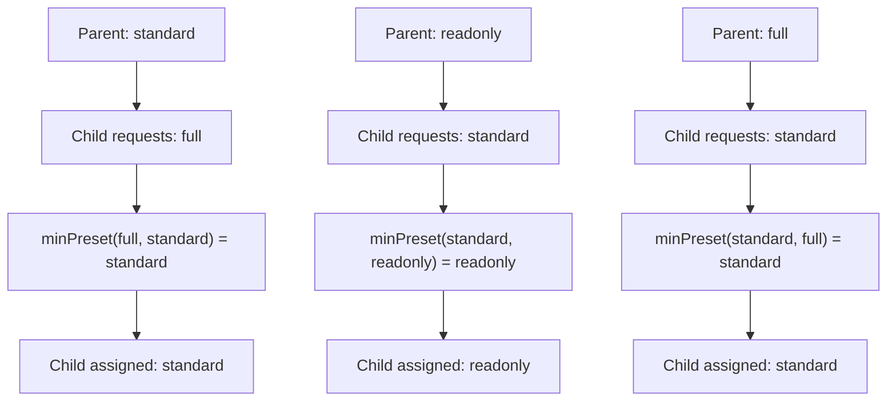

# Operators

Operators are named AI agents that run inside Claude Drive. Each operator has a role, a task, a permission preset, and an isolated memory store. Multiple operators can be active simultaneously — one in the foreground and the rest in the background — enabling multi-agent pair programming workflows where specialized agents collaborate on the same codebase without stepping on each other.

The operator system is the core scheduling primitive in Claude Drive. The extension tracks all operators in a central registry (`src/operatorRegistry.ts`) and coordinates their lifecycle, delegation, and memory through MCP tool calls.

See also: [CLI reference](./cli-reference.md) | [MCP tools](./mcp-tools.md)

---

## Operator lifecycle

### State diagram



**Notes:**
- Only one operator is `active` (foreground) at a time.
- When the active operator is dismissed, the registry auto-promotes the next available background operator.
- `merge()` copies the source operator's memory to the target, then sets the source status to `merged`.

### OperatorContext fields

| Field | Type | Description |
|-------|------|-------------|
| `id` | `string` | Unique ID: `operator-{timestamp}-{random}` |
| `name` | `string` | Display name from the name pool (e.g., Alpha, Beta) |
| `role` | `string?` | One of: `implementer`, `reviewer`, `tester`, `researcher`, `planner` |
| `task` | `string` | Current task description |
| `status` | `string` | `active` \| `background` \| `completed` \| `merged` \| `paused` |
| `createdAt` | `number` | Unix timestamp |
| `memory` | `string[]` | Up to 50 entries; last 10 injected into system prompt |
| `visibility` | `string` | `isolated` \| `shared` \| `collaborative` |
| `depth` | `number` | Hierarchy depth (0 = top-level) |
| `parentId` | `string?` | Parent operator ID for delegated children |
| `permissionPreset` | `string` | `readonly` \| `standard` \| `full` |
| `systemHint` | `string?` | Role-specific behavior hint injected into system prompt |
| `worktreePath` | `string?` | Git worktree path (planned) |
| `branchName` | `string?` | Branch for this operator's worktree (planned) |
| `baseCommit` | `string?` | Commit worktree was forked from (planned) |
| `headCommit` | `string?` | Latest commit in operator's worktree (planned) |
| `syncState` | `object?` | Cross-operator sync state from `syncTypes.ts` |

---

## Roles

Each role has a default permission preset and a system hint that shapes the operator's behavior. The system hint is injected into the operator's system prompt at spawn time.

| Role | Default Preset | Description | Behavior summary |
|------|---------------|-------------|-----------------|
| `implementer` | standard | Writes and modifies code | Follow existing patterns; report touched files via `agent_screen_file` |
| `reviewer` | readonly | Reviews code without modifying | No edits; report findings via `agent_screen_decision` |
| `tester` | standard | Writes and runs tests | Write and execute tests; report results via `agent_screen_activity` |
| `researcher` | readonly | Researches solutions and patterns | Explore codebase and web; no production file edits |
| `planner` | readonly | Creates plans and task breakdowns | Analyze requirements; produce plan artifacts; no code changes |

---

## Permission presets

Presets control which MCP tools an operator may call.

| Preset | Allowed tools |
|--------|--------------|
| `readonly` | Read, Glob, Grep, WebSearch, WebFetch |
| `standard` | Read, Glob, Grep, WebSearch, WebFetch, Edit, Write, Bash, Agent |
| `full` | Same as standard (reserved for future extension) |

### Permission cascade

Child operators cannot exceed their parent's permission level. When a child operator is spawned with a requested preset, the registry applies `minPreset(requested, parent.preset)` before assigning:

```
readonly < standard < full   (ordered from most to least restrictive)
```



The cascade is applied recursively through the hierarchy, so a deeply nested child can never exceed the most restrictive ancestor in its chain.

---

## Registry operations

All methods are available on the `OperatorRegistry` instance exported from `src/operatorRegistry.ts`. MCP-facing wrappers live in `src/operatorManager.ts`.

| Method | Signature | Description |
|--------|-----------|-------------|
| `spawn` | `(name?, task, options?)` → `OperatorContext` | Create a new operator. First operator becomes active; subsequent ones start as background. |
| `switchTo` | `(nameOrId)` → `OperatorContext` | Promote a background operator to active; previous active → background. |
| `dismiss` | `(nameOrId)` → `void` | Set status to `completed`; auto-promote next background operator if the active one was dismissed. Cascades to children. |
| `pause` | `(nameOrId)` → `void` | Set status to `paused`; operator is suspended but not removed. |
| `resume` | `(nameOrId)` → `void` | Resume a paused operator; status → `background`. |
| `merge` | `(source, target)` → `void` | Copy source memory entries to target; set source status to `merged`. |
| `delegate` | `(from, to, task)` → `OperatorContext` | Spawn a child operator under `from`, or reassign `to`'s task. Sets `parentId` and applies permission cascade. |
| `escalate` | `(idOrName, reason, severity)` → `void` | Fire an `operatorEscalated` event on `registry.events`. |

### Events

The registry exposes an `EventEmitter` at `registry.events`. Consumers subscribe to these events for UI updates and orchestration hooks:

| Event | Payload | Fired when |
|-------|---------|------------|
| `operatorCompleted` | `{ id, task }` | `dismiss()` completes successfully |
| `operatorProgress` | `{ id, message }` | Operator reports progress mid-task |
| `operatorError` | `{ id, error }` | Operator encounters an unrecoverable error |
| `taskDelegated` | `{ fromId, toId, task }` | `delegate()` assigns a task to another operator |
| `operatorEscalated` | `EscalationEvent` | `escalate()` is called; severity: `info` \| `warning` \| `critical` |

---

## Memory system

Each operator has a `memory` array (type `string[]`) that persists across turns within a session.

- **Capacity:** Maximum 50 entries. When the limit is reached, the oldest entry is evicted (FIFO).
- **Injection:** The last 10 entries are injected into the operator's system prompt on every turn, giving the agent short-term recall without exceeding context limits.
- **Updates:** Operators write to their own memory via the `operator_update_memory` MCP tool. The registry validates and stores the entry; no direct mutation from outside.
- **Merge behavior:** When `merge(source, target)` is called, all of `source.memory` is appended to `target.memory` (subject to the 50-entry cap). This is the primary mechanism for consolidating findings between a sub-agent and its parent.

Memory is session-scoped. It is not persisted to disk and is cleared when the extension reloads or the operator is dismissed.

---

## Name pool

When an operator is spawned without an explicit `name`, the registry assigns the next available name from the configured name pool. The default pool is:

```
Alpha, Beta, Gamma, Delta, Echo, Foxtrot
```

Names cycle through the pool in order. If all pool names are in use, the registry falls back to the operator's ID prefix. The name pool can be overridden in extension settings under `cursorDrive.namePool`.

Names are display identifiers only — the canonical identifier for all registry operations is `id`.

---

## Examples

### Spawn an operator

Via CLI:

```bash
drive operator spawn --task "Refactor auth module to use JWT" --role implementer
```

Via MCP tool call (from a Cursor Composer operator):

```json
{
  "tool": "drive_spawn_operator",
  "arguments": {
    "task": "Refactor auth module to use JWT",
    "role": "implementer"
  }
}
```

The registry returns an `OperatorContext`. If this is the first operator, it becomes active immediately. Otherwise it starts as background.

---

### Switch to a background operator

Via CLI:

```bash
drive operator switch Beta
```

Via MCP tool call:

```json
{
  "tool": "drive_switch_operator",
  "arguments": {
    "nameOrId": "Beta"
  }
}
```

The current active operator moves to background; Beta becomes active.

---

### Delegate a sub-task

Via CLI:

```bash
drive operator delegate --from Alpha --task "Write unit tests for auth module" --role tester
```

Via MCP tool call:

```json
{
  "tool": "drive_delegate",
  "arguments": {
    "from": "Alpha",
    "task": "Write unit tests for auth module",
    "role": "tester"
  }
}
```

A new child operator is spawned with `parentId = Alpha.id`. Its permission preset is capped at Alpha's preset via the cascade rule.

---

### Merge findings back to parent

Via CLI:

```bash
drive operator merge --source Beta --target Alpha
```

Via MCP tool call:

```json
{
  "tool": "drive_merge_operator",
  "arguments": {
    "source": "Beta",
    "target": "Alpha"
  }
}
```

Beta's memory entries are copied to Alpha's memory (up to the 50-entry cap). Beta's status is set to `merged` and it is removed from the foreground/background pool.

---

### Write to operator memory

Operators call this tool during their own turn to record a decision or finding:

```json
{
  "tool": "operator_update_memory",
  "arguments": {
    "entry": "Confirmed: JWT secret is read from env var JWT_SECRET, not hardcoded."
  }
}
```

The entry is appended to the operator's `memory` array. The oldest entry is dropped if the array exceeds 50 items.
