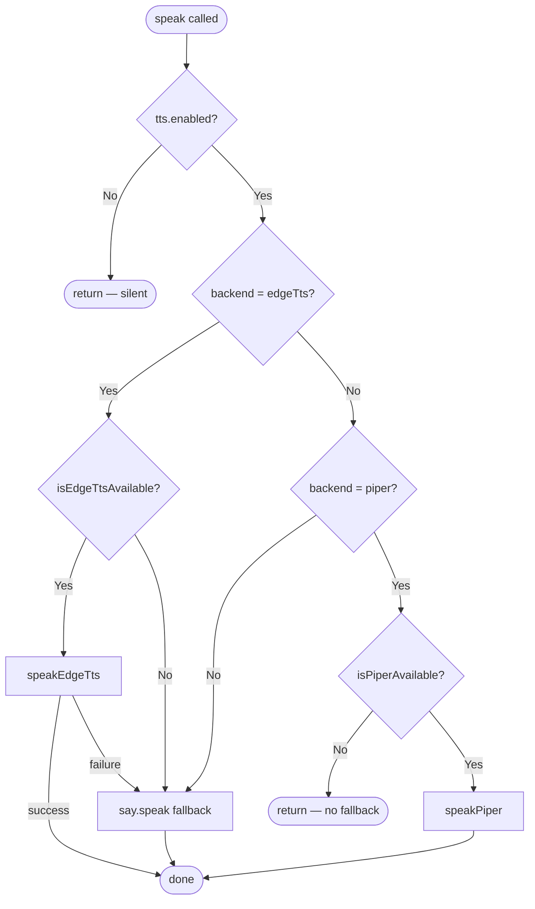

# TTS Setup

Claude Drive supports spoken operator output via three TTS backends. Speech is triggered whenever an operator calls `drive_speak` through the MCP server, and the active backend is selected at extension startup based on your [configuration](./configuration.md).

## Backend Comparison

| Backend   | Internet Required | Platform              | Quality  | Config Required                              | Notes                                     |
|-----------|-------------------|-----------------------|----------|----------------------------------------------|-------------------------------------------|
| `edgeTts` | Yes               | All                   | High     | Set `tts.backend` to `edgeTts`               | Uses Microsoft Edge online TTS; neural voices; falls back to `say` on failure |
| `piper`   | No                | All (binary per OS)   | High     | `tts.piperBinaryPath`, `tts.piperModelPath`  | Fully offline; no fallback on failure     |
| `say`     | No                | macOS / Windows / Linux | Medium | None (built-in) or install `espeak` on Linux | Cross-platform fallback; voice quality varies by OS |

## Backend Selection Flowchart



## Edge TTS Setup

Edge TTS uses Microsoft's online neural voice service via the `edge-tts-universal` package, which is bundled with Claude Drive.

1. Ensure you have an active internet connection when speaking.
2. Set the backend in your config:

```json
{
  "tts.backend": "edgeTts",
  "tts.voice": "en-US-JennyNeural"
}
```

3. Choose a voice. Popular options:

| Voice name              | Locale       | Style  |
|-------------------------|--------------|--------|
| `en-US-JennyNeural`     | US English   | Friendly, neutral |
| `en-US-GuyNeural`       | US English   | Male, conversational |
| `en-GB-SoniaNeural`     | British English | Female, professional |
| `en-AU-NatashaNeural`   | Australian English | Female |
| `en-CA-ClaraNeural`     | Canadian English | Female |

If the Edge TTS service is unreachable, Claude Drive automatically falls back to the `say` backend for that utterance.

## Piper Setup

Piper is a fully offline, local neural TTS engine. It requires a separate binary and a voice model file.

1. Download the Piper binary for your OS from the [Piper releases page](https://github.com/rhasspy/piper/releases). Extract the archive to a stable location, for example:
   - macOS/Linux: `~/.local/share/piper/piper`
   - Windows: `C:\piper\piper.exe`

2. Download a voice model from the same releases page. Each voice consists of two files:
   - `<voice>.onnx` — the model weights
   - `<voice>.onnx.json` — the voice config

   Example: `en_US-lessac-medium.onnx` + `en_US-lessac-medium.onnx.json`

3. Set the paths in your config:

```json
{
  "tts.backend": "piper",
  "tts.piperBinaryPath": "/home/user/.local/share/piper/piper",
  "tts.piperModelPath": "/home/user/.local/share/piper/voices/en_US-lessac-medium.onnx"
}
```

4. Make the binary executable (macOS/Linux):

```bash
chmod +x ~/.local/share/piper/piper
```

If `isPiperAvailable()` returns false (binary path not found or not executable), Claude Drive returns silently without speaking — there is no fallback when Piper is configured but unavailable.

## Say Fallback Setup

The `say` backend uses OS-native speech synthesis and requires no additional configuration on macOS or Windows.

**macOS** — Built-in via the `say` command. No setup required. Available system voices can be listed with:

```bash
say -v '?'
```

**Windows** — Built-in via PowerShell SAPI. No setup required. Voices are managed through **Settings > Time & Language > Speech**.

**Linux** — Requires `espeak` or `festival` to be installed:

```bash
# Debian / Ubuntu
sudo apt install espeak

# Fedora
sudo dnf install espeak

# Arch
sudo pacman -S espeak-ng
```

Set a voice name via `tts.voice` (OS-specific name string) and speed via `tts.speed`.

## Config Examples

### Edge TTS

```json
{
  "tts.enabled": true,
  "tts.backend": "edgeTts",
  "tts.voice": "en-US-JennyNeural",
  "tts.maxSpokenSentences": 3,
  "tts.interruptOnInput": true
}
```

### Piper (offline)

```json
{
  "tts.enabled": true,
  "tts.backend": "piper",
  "tts.piperBinaryPath": "/home/user/.local/share/piper/piper",
  "tts.piperModelPath": "/home/user/.local/share/piper/voices/en_US-lessac-medium.onnx",
  "tts.maxSpokenSentences": 3,
  "tts.interruptOnInput": true
}
```

### Say (OS fallback)

```json
{
  "tts.enabled": true,
  "tts.backend": "say",
  "tts.voice": "Samantha",
  "tts.speed": 1.0,
  "tts.volume": 0.8,
  "tts.maxSpokenSentences": 3
}
```

## Disabling TTS

To silence all spoken output without changing the rest of your config:

```bash
claude-drive config set tts.enabled false
```

Or set it directly in your config file:

```json
{
  "tts.enabled": false
}
```

When `tts.enabled` is `false`, `speak()` returns immediately and no audio is produced regardless of the configured backend.

## Troubleshooting

**No sound at all**
- Confirm `tts.enabled` is `true`.
- Check that your system audio output is not muted.
- If using `edgeTts`, verify internet connectivity.
- If using `piper`, run `isPiperAvailable()` check: confirm the binary path is correct and the file is executable (`chmod +x`).

**Wrong voice or accent**
- `tts.voice` is passed directly to the backend. For `edgeTts`, use an exact neural voice name (e.g., `en-US-JennyNeural`). For `say` on macOS, use a name from `say -v '?'`.
- On Windows SAPI, the voice string must match the installed voice name exactly.

**Piper binary not found**
- Double-check `tts.piperBinaryPath` is an absolute path.
- On macOS/Linux, run `ls -l <path>` to confirm the file exists and has execute permission.
- On Windows, ensure the path uses backslashes or escaped forward slashes and points to `piper.exe`.

**Edge TTS falls back to `say` unexpectedly**
- This means `speakEdgeTts()` threw an error. Common causes: no internet, a transient Microsoft service outage, or an invalid voice name.
- Check the Claude Drive output channel in VS Code for the underlying error message.

**`say` speaks too fast or too slow**
- Adjust `tts.speed`. Accepted range is `0.5`–`2.0` (1.0 = normal speed).

**Only the first sentence is spoken**
- `tts.maxSpokenSentences` caps how many sentences are spoken per call. Increase the value or set it to a high number to speak full messages.
